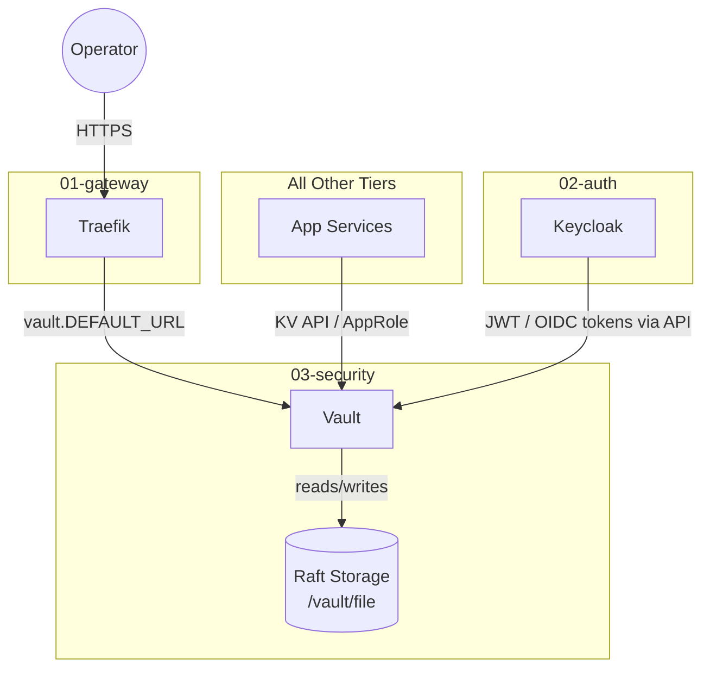

# Vault system context (03-security)

This document covers Vault's role in the platform, how data flows to and from it, and what depends on it at runtime.

## Role

Vault is the single source of truth for secrets across the entire stack. Instead of scattering passwords and tokens across `.env` files, services retrieve them via the Vault API using a token or AppRole credential. This makes secret rotation a Vault operation rather than a deployment operation.

The one deliberate exception is the set of secrets Vault itself needs to start — those live in `secrets/**/*.txt` and are injected by Docker as `/run/secrets/` files.

## Architecture

## Data flow

Vault itself does not pull data from other services at runtime. Traffic flows inward:

1. An operator or service calls the Vault API over `infra_net` (`http://vault:8200`).
2. Vault authenticates the caller (token, AppRole, or JWT/OIDC method).
3. Vault reads the secret from Raft storage and returns it over the same connection.
4. The caller uses the secret value and discards the connection.

Lease renewal and token revocation follow the same path.

## Persistence model

| Storage | Path | Type | Contents |
| :--- | :--- | :--- | :--- |
| `vault-data` Docker volume | `/vault/file` | Raft (integrated) | All secrets, policies, auth methods, audit logs |
| `./config` bind mount | `/vault/config` | Read-only | `vault.hcl` — listener, storage, telemetry config |

Raft is the only storage backend configured. There is no external Consul dependency.

## Network boundaries

| Endpoint | Listener | Who reaches it |
| :--- | :--- | :--- |
| `http://vault:8200` | `infra_net` (internal) | All services on the network |
| `https://vault.${DEFAULT_URL}` | Traefik (public) | Operator browser / CLI |
| `https://vault:8201` | `infra_net` (internal) | Raft cluster traffic (single-node: self only) |

TLS is terminated at Traefik for the public endpoint. Internal service-to-service traffic uses plain HTTP on port 8200.

## External dependencies

| Dependency | Tier | Why |
| :--- | :--- | :--- |
| `traefik` | 01-gateway | Routes `vault.${DEFAULT_URL}` and terminates TLS |
| Host filesystem | — | Stores Raft data at `${DEFAULT_SECURITY_DIR}/vault` |

Vault has no hard runtime dependency on any database or auth service. It is intentionally isolated so that other tiers can depend on it without creating circular startup chains.

## What depends on Vault

At this point in the stack, Vault is a manual-integration service — applications call its API directly rather than receiving secrets pushed at container start. The dependency is soft: if Vault is sealed or unreachable, applications that call it will fail to read secrets, but they will not fail to start unless they require a secret before their first healthcheck passes.
