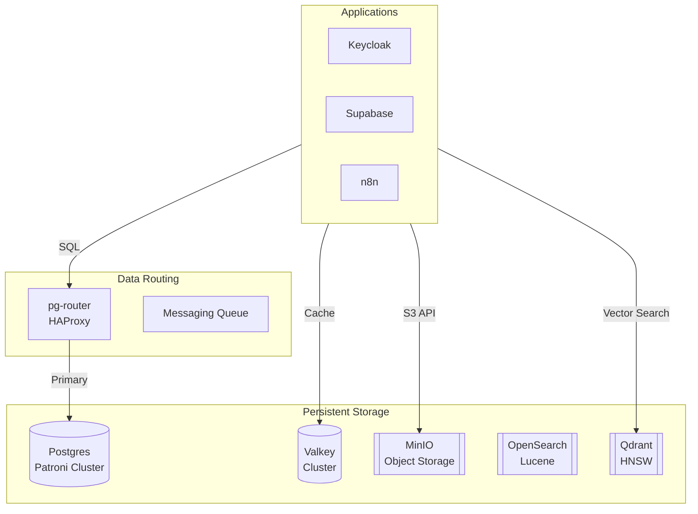

# Data Tier: Context & Architecture

**Overview (KR):** `04-data` 티어의 관계형 데이터베이스(PostgreSQL), NoSQL, 인메모리 캐시(Valkey), 오브젝트 스토리지(MinIO), 검색 엔진(OpenSearch) 및 벡터 DB(Qdrant)의 통합 아키텍처와 데이터 흐름 가이드입니다.

## 1. Architectural Topology

The Data tier is the persistence backbone of the stack, categorized by access patterns:

### Core Engines (Primary)
- **Relational (PostgreSQL)**: Primary state via Patroni HA Cluster (Leader + 2 Replicas).
- **In-Memory (Valkey)**: Caching and session management via 6-node cluster.
- **Object Storage (MinIO)**: S3-compatible storage for LGTM stack (Loki/Tempo) and CDN assets.
- **Search (OpenSearch)**: Distributed log search and analytics.
- **Vector (Qdrant)**: High-performance vector store for RAG and AI memory.

### Extended Engines (Secondary/Specialized)
- **NoSQL**: MongoDB, Cassandra, CouchDB (Experimental/Project-specific).
- **Graph**: Neo4j.
- **File System**: SeaweedFS.

## 2. Shared Infrastructure

### Network & Routing
- **Internal Network**: All databases reside on `infra_net`.
- **Database Routing**: 
  - PostgreSQL: `pg-router:5000` (Write), `pg-router:5001` (Read).
  - Valkey: `valkey-insight.${DEFAULT_URL}` for management.
  - MinIO: `minio.${DEFAULT_URL}` (API), `minio-console.${DEFAULT_URL}` (UI).

### Persistence Layout
All data is stored under `${DEFAULT_DATA_DIR}` on the host:
- `${DEFAULT_DATA_DIR}/pg/` -> PostgreSQL Spilo data.
- `${DEFAULT_DATA_DIR}/minio/` -> MinIO S3 data.
- `${DEFAULT_DATA_DIR}/opensearch/` -> Search indices.
- `${DEFAULT_DATA_DIR}/valkey/` -> In-memory snapshots (AOF/RDB).

## 3. Data Flow Diagram

## 4. Integration Logic
Services check database health via init-containers or `depends_on` healthchecks before proceeding with migrations or startup.
