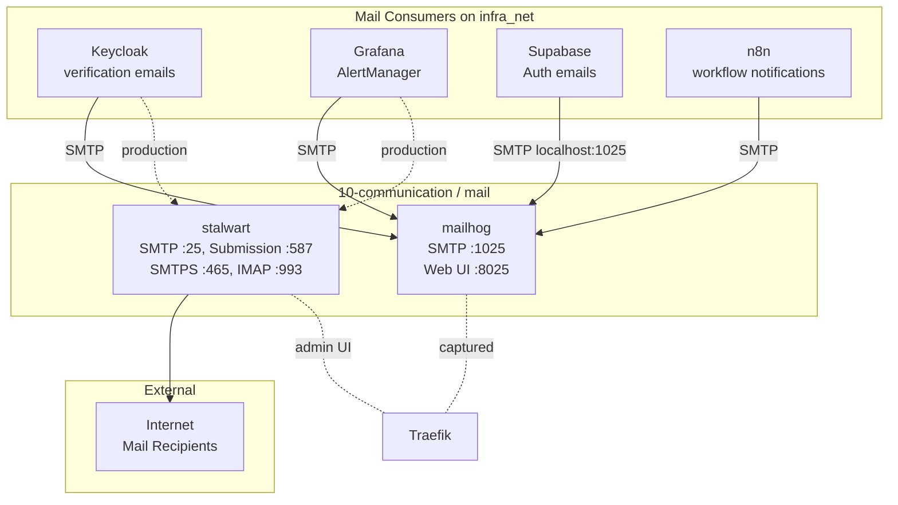

# Mail Services Context Guide

**Overview (KR):** `10-communication` 티어의 MailHog(개발용 SMTP 트랩)와 Stalwart(프로덕션 메일 서버)의 아키텍처, 라이프사이클, 통합 지점을 설명합니다.

## 1. Role in the Stack

The `10-communication` tier provides email infrastructure for other services in `infra_net`. It is optional — the rest of the stack runs without it — but several services depend on a working SMTP endpoint to send verification emails and alerts.

Two services are available:

| Service | Use Case | Delivery |
| :--- | :--- | :--- |
| **MailHog** | Development and testing | No — traps mail in memory |
| **Stalwart** | Production or staging with real delivery | Yes — full SMTP/IMAP server |

Only one should act as the active SMTP relay at a time. Applications target either `mailhog:1025` or `stalwart:25` depending on the environment.

## 2. Architecture



In development, all mail flows to MailHog and is visible at `https://mailhog.${DEFAULT_URL}`. In production, Stalwart receives mail on standard ports and delivers externally. The Stalwart admin panel is at `https://mail.${DEFAULT_URL}`.

## 3. Services

### MailHog

| Property | Value |
| :--- | :--- |
| Image | `mailhog/mailhog:v1.0.1` |
| Container | `mailhog` |
| Profile | `communication` |
| SMTP port (internal) | `1025` |
| Web UI port | `8025` |
| Traefik route | `https://mailhog.${DEFAULT_URL}` |
| Persistence | None — in-memory only |
| Secrets | None |

MailHog accepts any inbound SMTP connection with no authentication and no TLS. All messages are held in memory. A container restart clears all captured mail.

### Stalwart

| Property | Value |
| :--- | :--- |
| Image | `stalwartlabs/stalwart:v0.14` |
| Container | `stalwart` |
| Profile | `communication` |
| SMTP port | `25` (internal + host-exposed) |
| Submission port | `587` (STARTTLS) |
| SMTPS port | `465` (TLS) |
| IMAPS port | `993` (TLS) |
| ManageSieve port | `4190` |
| Admin port | `${STALWART_PORT:-8080}` |
| Traefik route | `https://mail.${DEFAULT_URL}` |
| Persistence | `stalwart-data` volume → `${DEFAULT_COMMUNICATION_DIR}/stalwart/data` |
| Secrets | `stalwart_password` |
| Certs | `secrets/certs/` (mounted read-only at `/opt/stalwart/certs`) |

Stalwart is a full mail server. First-run initialization creates a default config in the data volume. The admin user is `admin` with password from the `stalwart_password` Docker secret.

## 4. Secrets and Volumes

### Secrets

| Secret | File | Description |
| :--- | :--- | :--- |
| `stalwart_password` | `secrets/common/stalwart_password.txt` | Stalwart admin password, injected at startup |

The secret is read and exported as `STALWART_ADMIN_PASSWORD` inside the container entrypoint script.

### Volumes

| Volume | Host Path | Mount Point |
| :--- | :--- | :--- |
| `stalwart-data` | `${DEFAULT_COMMUNICATION_DIR}/stalwart/data` | `/opt/stalwart` |
| *(bind)* | `secrets/certs/` | `/opt/stalwart/certs` (read-only) |

The host path must exist before starting Stalwart:

```bash
mkdir -p "${DEFAULT_COMMUNICATION_DIR}/stalwart/data"
```

## 5. Lifecycle

### Starting the communication tier

```bash
# From project root
docker compose --profile communication up -d
```

This starts both MailHog and Stalwart. To start only one:

```bash
docker compose --profile communication up -d mailhog
docker compose --profile communication up -d stalwart
```

### Checking status

```bash
docker ps --filter label=hy-home.tier=communication
docker inspect --format='{{.State.Health.Status}}' mailhog
docker inspect --format='{{.State.Health.Status}}' stalwart
```

### Stalwart first-run bootstrap

On first start, Stalwart auto-configures itself in the data volume. The admin password is set from `stalwart_password` at container startup. Access the admin panel to complete SMTP relay, DKIM, and TLS configuration:

```text
https://mail.${DEFAULT_URL}
```

Login: `admin` / `<contents of secrets/common/stalwart_password.txt>`

### Graceful shutdown

```bash
docker compose --profile communication stop
```

Stalwart persists state to the volume; MailHog loses all in-memory mail on stop.

### Resetting MailHog mail history

```bash
docker restart mailhog
```

### Full reset of Stalwart data

```bash
docker compose --profile communication down
rm -rf "${DEFAULT_COMMUNICATION_DIR}/stalwart/data"
mkdir -p "${DEFAULT_COMMUNICATION_DIR}/stalwart/data"
docker compose --profile communication up -d stalwart
```

## 6. Integration Points

| Consumer | SMTP Target (dev) | SMTP Target (prod) | Notes |
| :--- | :--- | :--- | :--- |
| Keycloak | `mailhog:1025` | `stalwart:587` | Set in Keycloak realm email settings |
| Grafana AlertManager | `mailhog:1025` | `stalwart:587` | `alertmanager.yml` SMTP config |
| Supabase Auth | `mailhog:1025` (via `SUPABASE_SMTP_HOST`) | `stalwart:587` | `.env` variables |
| n8n | `mailhog:1025` | `stalwart:587` | n8n credential settings |

In `.env.example`, Supabase is pre-configured for MailHog:

```env
SUPABASE_SMTP_HOST="mailhog"
SUPABASE_SMTP_PORT="1025"
```

## 7. References

- [Mail Relay Operations](mail-relay-operations.md) — MailHog procedures
- [Mail Server Operations](mail-server-operations.md) — Combined MailHog + Stalwart procedures
- [Infra mail/ README](../../../infra/10-communication/mail/README.md) — Service definitions and config
- [ARCHITECTURE.md](../../../ARCHITECTURE.md) — Tier overview
