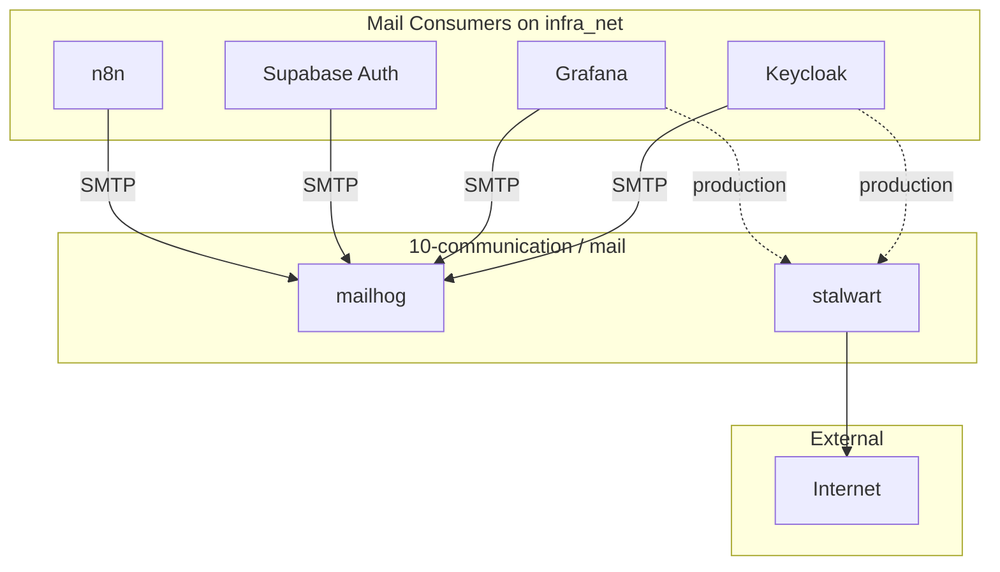

# Communication Tier: Context & Architecture

**Overview (KR):** `10-communication` 티어의 MailHog(개발용 SMTP 트랩)와 Stalwart(프로덕션 메일 서버)의 아키텍처, 서비스 인벤토리 및 통합 지점을 설명합니다.

## 1. Role in the Stack

The `10-communication` tier provides email infrastructure for other services in `infra_net`. It is optional but several services depend on a working SMTP endpoint to send verification emails and alerts.

## 2. Architecture

## 3. Service Inventory

| Service | Use Case | SMTP Target | UI Access |
| :--- | :--- | :--- | :--- |
| **MailHog** | Dev SMTP trap | `mailhog:1025` | `https://mailhog.${DEFAULT_URL}` |
| **Stalwart** | Production server | `stalwart:587` | `https://mail.${DEFAULT_URL}` |

## 4. Integration Points

Consult [USAGE.md](USAGE.md) for specific application configurations.
