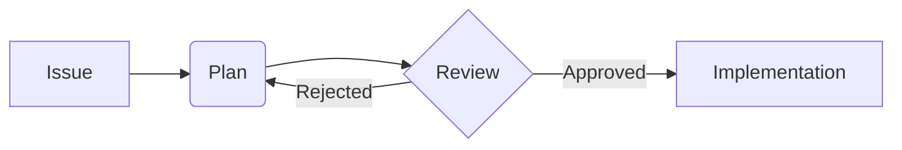

# 📝 Documentation Standards

본 프로젝트에서 문서는 코드만큼 중요하게 다뤄집니다. 일관성 있고 읽기 쉬운 문서를 작성하기 위한 표준입니다.

## 1. Markdown Style Guide

- **Heading Hierarchy**: 하나의 파일에는 하나의 `H1`만 존재해야 합니다. 계층 구조를 명확히 하십시오.
- **Lists**: 가독성을 위해 불렛 포인트나 번호 매기기를 적극 활용하십시오.
- **Emphasis**: 중요한 용어나 고유 명사는 **굵게** 표시하십시오.
- **Links**: 내부 파일 참조 시 가능한 한 [절대 경로](file:///d:/path/to/file) 형식을 사용하여 도구간 호환성을 유지하십시오.

## 2. Diagramming (Mermaid)

시스템 아키텍처나 워크플로우를 시각화할 때는 `Mermaid`를 사용합니다.

- **Flowcharts**: 프로세스 흐름 설명용.
- **C4 Diagrams**: 시스템 컨텍스트 및 관계 정의용.
- **Sequence Diagrams**: 서비스 간 메시지 교환 설명용.

### 예시 (Flow)

## 3. Architecture Decision Records (ADR)

중요한 설계 결정은 `docs/adr/`에 기록되어야 합니다.

- **작성 시점**: 기술 스택 변경, 네트워크 구조 변경, 보안 정책 변경 등 영향도가 큰 결정 시.
- **포맷**: `NNNN-title.md` 형식을 준수하며, 결정의 배경(Context)과 결과(Consequences)를 반드시 포함합니다.

## 4. Documentation Lifecycle

- **Creation**: 새로운 프로젝트나 서비스 추가 시 기본 `README.md` 작성 필수.
- **Review**: PR 제출 전 문서 업데이트 여부를 체크리스트로 확인.
- **Sunset**: 더 이상 사용되지 않는 문서나 서비스 정보는 `archive/` 폴더로 이동하거나 삭제 처리.

## 5. Tool Integration

- **Markdown Lint**: GitHub Actions 워크플로우를 통해 문법 오류를 자동으로 검사합니다.
- **AI-Friendly**: 문서는 AI 에이전트가 파싱하기 좋게 구조화된 텍스트와 명확한 태그를 사용합니다.
