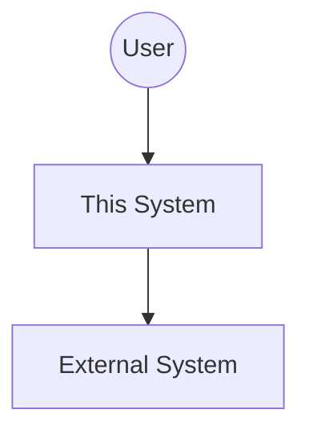
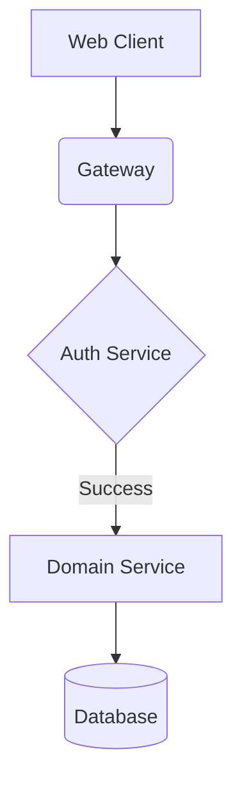

# Architecture Requirements Document ([System/Domain])

> **Status**: [Draft | Proposed | Approved | Deprecated]
> **Version**: v1.0.0
> **Date**: YYYY-MM-DD
> **Layer**: architecture
> **Scope**: [master | domain]
> **Related PRD**: [Link to PRD]
> **Related ADRs**: [Link to ADR List]

**Overview (KR):** [시스템의 아키텍처적 경계, 주요 설계 원칙, 그리고 준수해야 할 기술적 제약 사항을 한국어로 1-2문장 요약하세요.]

---

## 1. Context & Architecture Style

**Objective**: Briefly describe the problem this architecture solves.

**Primary Principles**:
- [Principle 1, e.g., Event-Driven for decoupled services]
- [Principle 2, e.g., Mobile-First for user interfaces]

**Architecture Style**: [Monolithic | Microservices | Hub-and-Spoke | Evented]

---

## 2. System Boundary & Component Responsibilities

Define what this system owns and what it delegates to others.

| Component / Repo | Primary Responsibility | Key Tech / Tooling |
| ---------------- | ---------------------- | ------------------ |
| `[Comp 1]`       | [Responsibility]       | [Node.js / Docker] |
| `[Comp 2]`       | [Responsibility]       | [Python / FastAPI] |

---

## 3. High-Level Design (Mermaid/C4)

[Insert C4 Container or Component diagrams here using Mermaid.]

### 3.1. System Context Diagram

### 3.2. Container Diagram

---

## 4. Non-Functional Requirements (NFR)

| ID | Category | Requirement Detail | Priority |
| -- | -------- | ------------------ | -------- |
| **NFR-SEC-001** | Security | mTLS for all inter-service traffic | High |
| **NFR-PER-001** | Performance | P99 Latency < 200ms | Medium |
| **NFR-AVA-001** | Availability | 99.9% Uptime | High |

---

## 5. Strategic Trade-offs

| Alternative Considered | Chosen Path | Reason (Why) |
| ---------------------- | ----------- | ------------ |
| [Alternative 1]        | [Choice 1]  | [Logic]      |
| [Alternative 2]        | [Choice 2]  | [Logic]      |

---

## 6. Verification & Quality Gates

| Check / Gate        | Tooling / Method | Requirement |
| ------------------- | ---------------- | ----------- |
| **Linting**         | ESLint / Biome   | Mandatory   |
| **Unit Test**       | Jest / Vitest    | > 80% Cov   |
| **Security Scan**   | Trivy / Gitleaks | Mandatory   |
| **Architectural Review** | AI Agent / Manual | Mandatory   |

---

## 7. References

- [Link to PRD]
- [Link to Technology Stack ADR]
- [Link to Deployment Guideline]
