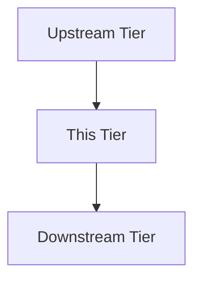

# Tier Guide: [Tier Name]

> **Status**: [Stable | Beta | Experimental]
> **Version**: v1.0.0
> **Date**: YYYY-MM-DD
> **Layer**: infra
> **Tier Number**: [01-10]

**Overview (KR):** [이 인프라 계층(Tier)의 목적, 포함된 주요 서비스들, 그리고 다른 계층과의 의존성 관계를 한국어로 1-2문장 요약하세요.]

---

## 1. Purpose & Scope

Conceptual boundary and responsibility of this tier.

* **Primary Responsibility**: [e.g., Routing and Security]
* **Included Services**:
  * [Service A]
  * [Service B]

---

## 2. Interaction Model

---

## 3. Infrastructure Standards

* **Resource Limits**: [CPU/Mem per service]
* **Network Isolation**: [Rules for this tier]

---

## 4. Verification & Testing

* **Pre-flight Check**: `bash scripts/preflight-compose.sh --profile [tier]`
* **Validation**: How to confirm this tier is operational.

---

## 5. Troubleshooting & FAQ

* **Q**: Common deployment failure?
* **A**: Check [Config X].
