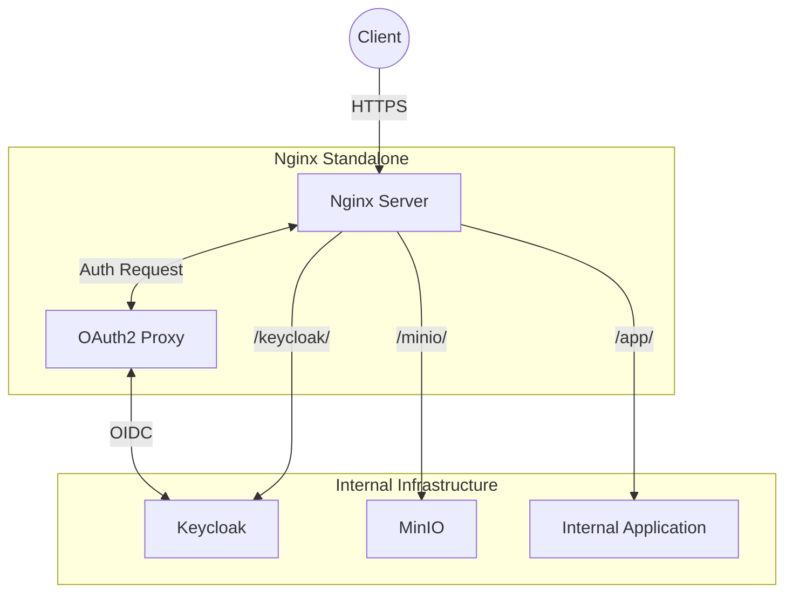

# Nginx Standalone Proxy

## Overview

A standalone **Nginx** reverse proxy and web server instance. While the primary gateway of this infrastructure is **Traefik**, this Nginx instance serves as an alternative ingress point, specifically optimized for path-based routing, advanced caching, and custom SSO integration.



## Services

| Service | Image | Role | Resources |
| :--- | :--- | :--- | :--- |
| `nginx` | `nginx:alpine` | Standalone Ingress / Reverse Proxy | 0.5 CPU / 512MB |

## Networking

This service runs on the `infra_net` network and exposes ports directly to the host to act as a standalone gateway.

| Service | Static IP | Protocol | Internal Port | Host Port |
| :--- | :--- | :--- | :--- | :--- |
| `nginx` | `172.19.0.13` | HTTP | `80` | `${HTTP_HOST_PORT}` |
| | | HTTPS | `443` | `${HTTPS_HOST_PORT}` |

## Persistence

| Volume | Mount Point | Description |
| :--- | :--- | :--- |
| `./config/nginx.conf` | `/etc/nginx/nginx.conf` | **Main Config**: Server blocks, Upstreams, SSL, SSO Logic |
| `secrets/certs/` | `/etc/nginx/certs` | **Certificates**: SSL/TLS certs and trusted CAs |

## Configuration & SSO Workflow

This Nginx instance is configured to support **Single Sign-On (SSO)** via **OAuth2 Proxy**.

### SSO Flow (Forward Auth)

1. **Request**: Client requests a protected path (e.g., `/app/`).
2. **Auth Check**: Nginx uses the `auth_request` module to send a sub-request to the OAuth2 Proxy (`/_oauth2_auth_check`).
3. **Result**:
    - If `401 Unauthorized`, Nginx redirects the user to `/oauth2/sign_in`.
    - If `200 OK`, Nginx proceeds to proxy the request to the upstream application, passing user information in headers (`X-User`, `X-Email`).

### Routing Path Map

| Path | Destination | Description |
| :--- | :--- | :--- |
| `/oauth2/` | `oauth2-proxy:4180` | Authentication endpoints (Login, Callback, etc.) |
| `/keycloak/`| `keycloak:8080` | Identity Provider Admin Console |
| `/minio/` | `minio:9000` | S3-Compatible Storage API |
| `/minio-console/` | `minio:9001` | MinIO Management UI |
| `/app/` | *(Internal App)* | Protected application path (SSO enforced) |

## Usage

### 1. Direct Access

Access services via the host machine's IP or DNS mapping using path-based URLs:

- `https://localhost:${HTTPS_HOST_PORT}/keycloak/`
- `https://localhost:${HTTPS_HOST_PORT}/minio-console/`

### 2. Monitoring Logs

```bash
# Monitor access/error logs
docker logs -f nginx
```

## Troubleshooting

### "Redirect Loop"

- Ensure `proxy_set_header X-Forwarded-Proto https;` is set.
- Verify Keycloak and Nginx agree on the scheme (HTTP vs HTTPS).

### "401 Unauthorized" (SSO Path)

- Check if you are correctly logged in via Keycloak.
- Verify OAuth2 Proxy is receiving the sub-request and validating the session token.

## File Map

| Path | Description |
| --- | --- |
| `docker-compose.yml` | Standalone Nginx service with host port exposure. |
| `config/nginx.conf` | Reverse proxy rules, SSL, OAuth2 auth_request flow. |
| `secrets/certs/` | TLS certificates for HTTPS termination (shared). |
| `README.md` | Usage and routing notes. |
