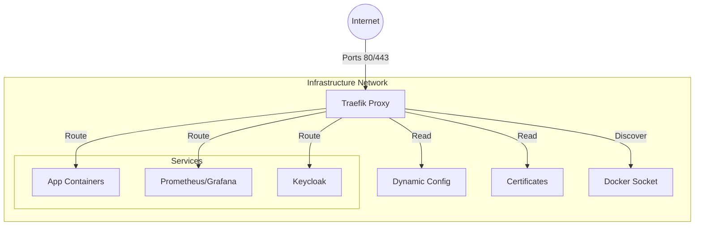

# Traefik Edge Router

## Overview

**Traefik** acts as the central **Edge Router** (Reverse Proxy) for the entire infrastructure. It handles incoming HTTP/HTTPS traffic, terminates SSL, and routes requests to appropriate Docker containers based on dynamic labels. It also enforces security policies like SSO and Rate Limiting.



## Services

| Service | Image | Role | Resources |
| :--- | :--- | :--- | :--- |
| `traefik` | `traefik:v3.6.6` | Ingress Gateway | 1.0 CPU / 1GB |

## Networking

Traefik occupies the static IP suffix `.13` on `infra_net` and listens on standard web ports.

| Service | Static IP | Ports | Host Aliases |
| :--- | :--- | :--- | :--- |
| `traefik` | `172.19.0.13` | `80` (HTTP)<br>`443` (HTTPS)<br>`8080` (Dashboard)<br>`8082` (Metrics) | `keycloak.*`, `auth.*`, `whoami.*` |

## Persistence

| Volume | Mount Point | Description |
| :--- | :--- | :--- |
| `./config/traefik.yml` | `/etc/traefik/traefik.yml` | **Static Config**: Entrypoints, Providers, Tracing |
| `./dynamic/` | `/dynamic/` | **Dynamic Config**: TLS Stores, Middlewares (BasicAuth, etc.) |
| `secrets/certs/` | `/certs/` | **Certificates**: Custom CA or wildcard certs |
| `/var/run/docker.sock` | `/var/run/docker.sock` | **Docker Socket**: For Service Discovery |

## Configuration

### Static Configuration (`traefik.yml`)

Defines the entrypoints (`web`, `websecure`, `metrics`) and enables the Docker provider.

### Dynamic Configuration (`dynamic/`)

Contains runtime configuration that can be updated without restarting Traefik.

- **Middlewares**: `dashboard-auth` (Basic Auth), `sso-auth` (ForwardAuth to OAuth2 Proxy).
- **TLS options**: default cipher suites, certificate files.

### Dashboard

The Traefik Dashboard is enabled and exposed with Basic Auth protection.

- **URL**: `https://dashboard.${DEFAULT_URL}`
- **Auth Middleware**: `dashboard-auth@file`

## Usage

### 1. Adding a New Service

To expose a Docker container via Traefik, add labels to its `docker-compose.yml`:

```yaml
labels:
  - "traefik.enable=true"
  - "traefik.http.routers.my-service.rule=Host(`service.${DEFAULT_URL}`)"
  - "traefik.http.routers.my-service.entrypoints=websecure"
  - "traefik.http.routers.my-service.tls=true"
  - "traefik.http.services.my-service.loadbalancer.server.port=3000"
```

### 2. Enabling SSO

To protect a service with Keycloak SSO (via OAuth2 Proxy), add the middleware:

```yaml
  - "traefik.http.routers.my-service.middlewares=sso-auth@file"
```

## Troubleshooting

### "404 Not Found"

- Check if the container is running and healthy.
- Verify `traefik.enable=true` label exists.
- Ensure the container is on the same Docker network (`infra_net`) as Traefik.

### "Internal Server Error" (SSO)

- Verify `oauth2-proxy` service is running.
- Check Traefik logs for ForwardAuth failures.

## File Map

| Path | Description |
| --- | --- |
| `docker-compose.yml` | Traefik edge router service definition. |
| `config/traefik.yml` | Static config (entrypoints, providers, metrics, tracing). |
| `config/traefik.yml.example` | Template for static config. |
| `dynamic/middleware.yml` | ForwardAuth, basic auth, and rate-limit middlewares. |
| `dynamic/tls.yaml` | TLS store and default cert config. |
| `dynamic/*.example` | Template files for dynamic config. |
| `secrets/certs/` | TLS certificates and root CA (shared). |
| `README.md` | Usage and routing notes. |
