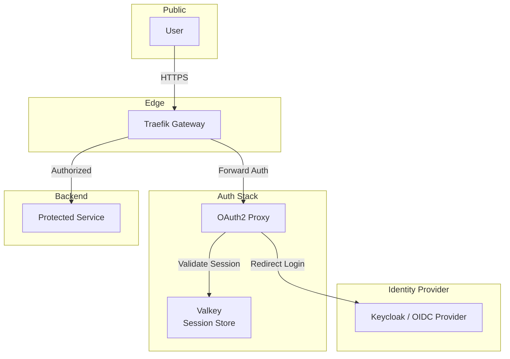

# OAuth2 Proxy (SSO)

## Overview

A flexible authentication proxy that acts as the **Global SSO (Single Sign-On)** provider for the infrastructure. It authenticates users against an external Identity Provider (Keycloak, Google, GitHub) and protects downstream services via Traefik Middleware.



## Services

| Service | Image | Role | Resources |
| :--- | :--- | :--- | :--- |
| `oauth2-proxy` | `quay.io/oauth2-proxy/oauth2-proxy:v7.13.0` | Auth Gateway | 0.5 CPU / 256MB |
| `oauth2-proxy-valkey` | `valkey/valkey:9.0.1` | Session Storage | 0.5 CPU / 256MB |
| `oauth2-proxy-valkey-exporter` | `oliver006/redis_exporter` | Metrics | .1 CPU / 128MB |

## Networking

Services run on `infra_net` with static IPs.

| Service | Static IP | Port (Internal) | Endpoint |
| :--- | :--- | :--- | :--- |
| `oauth2-proxy` | `172.19.0.28` | `${OAUTH2_PROXY_PORT}` (4180) | `auth.${DEFAULT_URL}` |
| `oauth2-proxy-valkey` | `172.19.0.18` | `${VALKEY_PORT}` | - |

## Configuration

### Config File (`config/oauth2-proxy.cfg`)

Contains the core logic for OIDC integration. Key settings typically include:

- `provider = "keycloak-oidc"`
- `oidc_issuer_url`: Keycloak realm URL (configured to `https://keycloak.127.0.0.1.nip.io/realms/hy-home.realm`)
- `redirect_url`: `https://auth.127.0.0.1.nip.io/oauth2/callback`
- `scope`: `openid email profile offline_access groups`
- `cookie_domains`: `.127.0.0.1.nip.io`
- `email_domains = "*"`, `whitelist_domains = "*.127.0.0.1.nip.io"`
- `upstreams = [ "static://200" ]` (auth-only response)

### Environment Variables

| Variable | Description | Value |
| :--- | :--- | :--- |
| `OAUTH2_PROXY_CLIENT_ID` | OIDC Client ID | (In .cfg or env) |
| `OAUTH2_PROXY_CLIENT_SECRET` | OIDC Secret | `${OAUTH2_PROXY_CLIENT_SECRET}` |
| `OAUTH2_PROXY_COOKIE_SECRET` | Cookie Config | `${OAUTH2_PROXY_COOKIE_SECRET}` |
| `SSL_CERT_FILE` | Trusted CA | `/etc/ssl/certs/rootCA.pem` |

### SSL/TLS

The proxy mounts `secrets/certs/rootCA.pem` to trust internal HTTPS connections (e.g., to Keycloak) if self-signed certificates are used in development.

## Usage

### 1. Protecting a Service (Traefik Middleware)

To protect any service with SSO, apply the following Traefik label in its `docker-compose.yml`:

```yaml
labels:
  - "traefik.http.routers.my-app.middlewares=sso-auth@file"
```

The `sso-auth` middleware (defined in Traefik's dynamic config) forwards requests to `http://auth.${DEFAULT_URL}/oauth2/auth`.

### 2. Manual Sign-In

- **URL**: `https://auth.${DEFAULT_URL}`
- **Action**: Redirects to the configured IdP (e.g., Keycloak).

## Troubleshooting

### "500 Internal Server Error"

Usually indicates Redis connection failure or Misconfigured Secret.

1. Check logs: `docker compose logs oauth2-proxy`
2. Verify Redis connection URL in `docker-compose.yml`.

### "x509: certificate signed by unknown authority"

The OAuth2 Proxy container doesn't trust the IdP (Keycloak) certificate.

- Ensure `rootCA.pem` is valid.
- Verify `SSL_CERT_FILE` env var is set correctly.

## File Map

| Path | Description |
| --- | --- |
| `docker-compose.yml` | OAuth2 Proxy + Valkey session store (default). |
| `docker-compose.redis.yml` | OAuth2 Proxy + Redis session store (alternative). |
| `config/oauth2-proxy.cfg` | Active Keycloak OIDC configuration (issuer, cookies, scopes). |
| `config/oauth2-proxy.cfg.example` | Template config. |
| `secrets/certs/` | Shared CA and TLS materials for IdP trust. |
| `README.md` | SSO wiring and usage notes. |
