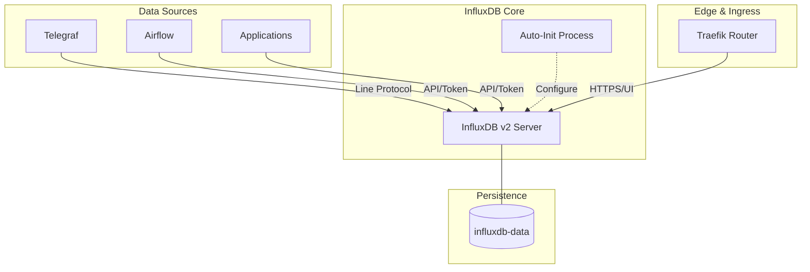

# InfluxDB

## Overview

**InfluxDB** is a high-performance open-source time-series database (TSDB) optimized for fast, high-availability storage and retrieval of time-stamped data. This deployment uses **InfluxDB v2**, providing an integrated environment for data collection, visualization, and alerting.

## Profile

This stack is **optional** and runs under the `influxdb` profile.

```bash
docker compose --profile influxdb up -d influxdb
```



## Services

| Service    | Image          | Role                             | Resources     |
| :--------- | :------------- | :------------------------------- | :------------ |
| `influxdb` | `influxdb:2.8` | Time-Series Database / Dashboard | 1.0 CPU / 1GB |

## Networking

This service is optional and uses a fixed IP for reliable internal telemetry collection without DNS dependency.

| Service    | Static IP     | Internal Port | Traefik Domain            |
| :--------- | :------------ | :------------ | :------------------------ |
| `influxdb` | `172.19.0.11` | `9999`        | `influxdb.${DEFAULT_URL}` |

## Persistence

| Volume          | Mount Point          | Description                                          |
| :-------------- | :------------------- | :--------------------------------------------------- |
| `influxdb-data` | `/var/lib/influxdb2` | Stores TSM data, metadata, and engine configuration. |

## Configuration (Auto-Initialization)

The container is configured for automated setup on the first start using `DOCKER_INFLUXDB_INIT_MODE=setup`.

| Variable             | Description          | Initial Value           |
| :------------------- | :------------------- | :---------------------- |
| `INFLUXDB_USERNAME`  | Admin Username       | `${INFLUXDB_USERNAME}`  |
| `INFLUXDB_PASSWORD`  | Admin Password       | `${INFLUXDB_PASSWORD}`  |
| `INFLUXDB_ORG`       | Default Organization | `${INFLUXDB_ORG}`       |
| `INFLUXDB_BUCKET`    | Default Data Bucket  | `${INFLUXDB_BUCKET}`    |
| `INFLUXDB_API_TOKEN` | Initial Admin Token  | `${INFLUXDB_API_TOKEN}` |

## Usage

### 1. Web UI Dashboard

Access the integrated dashboard at `https://influxdb.${DEFAULT_URL}`.

- Visualize data using Data Explorer (InfluxQL / Flux).
- Manage Buckets, Tokens, and Scrapers.
- Build and share multi-dimensional dashboards.

### 2. Client Connection (Python/Telegraf)

Use the **Internal Address** `http://influxdb:9999` or the **Static IP** `http://172.19.0.11:9999` with the following credentials:

- **Org**: `${INFLUXDB_ORG}`
- **Bucket**: `${INFLUXDB_BUCKET}`
- **Token**: Bearer or API Token authentication.

## Troubleshooting

### "Permission Denied on /var/lib/influxdb2"

Ensure the host directory mapped to the volume has the correct permissions for the `influxdb` user (UID 1000).

### "API Token Invalid"

If you manually change the token in the UI or CLI, ensure all dependent services (Telegraf, Airflow) are updated with the new `INFLUXDB_API_TOKEN`.

## File Map

| Path                 | Description                                    |
| -------------------- | ---------------------------------------------- |
| `docker-compose.yml` | InfluxDB v2 service definition with auto-init. |
| `README.md`          | Usage and configuration notes.                 |
