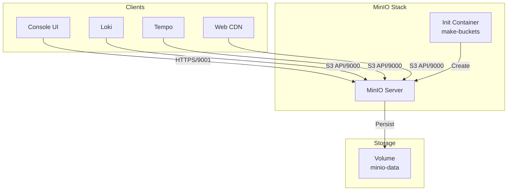

# MinIO Object Storage

## Overview

A high-performance, S3-compatible object storage server. This deployment acts as the central storage layer for logs (Loki), traces (Tempo), and static assets (CDN), initialized automatically via a sidecar container.



## Services

| Service                | Image                               | Role        | Resources       |
| :--------------------- | :---------------------------------- | :---------- | :-------------- |
| `minio`                | `minio/minio:RELEASE.2025-09-07...` | S3 Server   | 1 CPU / 1GB     |
| `minio-create-buckets` | `minio/mc:RELEASE.2025-08-13...`    | Init Script | 0.1 CPU / 128MB |

## Networking

Services run on `infra_net` with static IPs.

| Service | Static IP     | API Port                 | Console Port                     | Traefik Domain                                           |
| :------ | :------------ | :----------------------- | :------------------------------- | :------------------------------------------------------- |
| `minio` | `172.19.0.12` | `9000` (`${MINIO_PORT}`) | `9001` (`${MINIO_CONSOLE_PORT}`) | `minio.${DEFAULT_URL}`<br>`minio-console.${DEFAULT_URL}` |

## Persistence

| Volume       | Mount Point | Description         |
| :----------- | :---------- | :------------------ |
| `minio-data` | `/data`     | Object storage data |

## Configuration

### Secrets

Credentials are managed via Docker Secrets for security.

| Secret                    | Description                    |
| :------------------------ | :----------------------------- |
| `minio_root_user`         | Admin Username                 |
| `minio_root_password`     | Admin Password                 |
| `minio_app_user`          | Application User (for buckets) |
| `minio_app_user_password` | Application Password           |

### Environment Variables

| Variable                     | Description     | Value                   |
| :--------------------------- | :-------------- | :---------------------- |
| `MINIO_PROMETHEUS_AUTH_TYPE` | Metrics Auth    | `public` (for scraping) |
| `MINIO_API_ROOT_ACCESS`      | Root API Access | `on`                    |

## Initialization Process

The `minio-create-buckets` container runs on startup to:

1. Wait for MinIO to be healthy.
2. Authenticate as Root.
3. Create `minio_app_user` and assign `readwrite` policy.
4. Create required buckets:
   - `tempo-bucket`
   - `loki-bucket`
   - `cdn-bucket` (Set to Public)

## Usage

### 1. Web Console

- **URL**: `https://minio-console.${DEFAULT_URL}`
- **Login**: Use credentials from `.env` (or secrets).

### 2. S3 Access (Clients)

- **Endpoint**: `https://minio.${DEFAULT_URL}`
- **Region**: `us-east-1` (MinIO default)

### 3. CLI (mc)

You can interact with MinIO using the official client.

**Alias Configuration:**

```bash
mc alias set local http://localhost:${MINIO_HOST_PORT} ROOT_USER ROOT_PASSWORD
```

**Commands:**

```bash
# List buckets
mc ls local

# Upload file
mc cp my-file.txt local/cdn-bucket/

# Set bucket public
mc anonymous set public local/cdn-bucket
```

## Troubleshooting

### "Bucket already owned by you"

The init container prints "ignore-existing" warnings if buckets already exist. This is normal and indicates idempotency.

### "Init container fails"

If `minio-create-buckets` fails:

1. Check if `minio` service is healthy.
2. Verify secrets are correctly populated in `/run/secrets/`.
3. Check logs: `docker compose logs minio-create-buckets`

## File Map

| Path                          | Description                                      |
| ----------------------------- | ------------------------------------------------ |
| `docker-compose.yml`          | Single-node MinIO with bucket init sidecar.      |
| `docker-compose.cluster.yaml` | Multi-node (distributed) MinIO cluster template. |
| `README.md`                   | Usage and initialization notes.                  |
