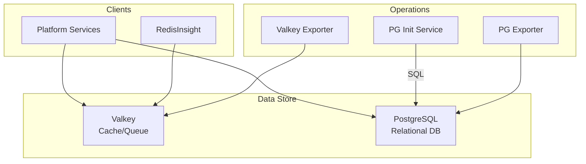

# Management Databases Infrastructure

## Overview

A shared data persistence layer acting as the backbone for various platform services. It hosts **Valkey** (for cache/queues) and **PostgreSQL** (for relational data), along with their monitoring exporters and management UIs.



## Services

| Service               | Image                      | Role                             | Resources       |
| :-------------------- | :------------------------- | :------------------------------- | :-------------- |
| `mng-valkey`          | `valkey/valkey:9.0.2-alpine`      | **Cache & Broker** (Redis Comp.) | 0.5 CPU / 512MB |
| `mng-pg`              | `postgres:17-bookworm`     | **Metadata Database**            | 1 CPU / 1GB     |
| `redisinsight`        | `redis/redisinsight:3.0.1` | Valkey UI Management             | 0.5 CPU / 512MB |
| `mng-pg-init`         | `postgres:17-alpine`       | DB Initializer                   | 0.5 CPU / 128MB |
| `mng-valkey-exporter` | `oliver006/redis_exporter` | Prometheus Metrics               | 0.1 CPU / 128MB |
| `mng-pg-exporter`     | `postgres-exporter`        | Prometheus Metrics               | 0.1 CPU / 128MB |

## Networking

Services run on `infra_net` with static IPs.

| Service        | Static IP     | Port (Internal) | Host Port          | Traefik Domain                |
| :------------- | :------------ | :-------------- | :----------------- | :---------------------------- |
| `mng-valkey`   | `172.19.0.70` | `6379`          | -                  | -                             |
| `mng-pg`       | `172.19.0.72` | `5432`          | `${POSTGRES_PORT}` | -                             |
| `redisinsight` | `172.19.0.68` | `5540`          | -                  | `redisinsight.${DEFAULT_URL}` |

## Persistence

| Volume              | Mount Point                | Description                |
| :------------------ | :------------------------- | :------------------------- |
| `mng-valkey-data`   | `/data`                    | Valkey AOF/RDB files       |
| `mng-pg-data`       | `/var/lib/postgresql/data` | PostgreSQL Data files      |
| `redisinsight-data` | `/db`                      | RedisInsight user settings |

## Configuration

### PostgreSQL Initialization

The `mng-pg-init` container runs automatically on startup.

- **Source**: `./init-scripts/init_users_dbs.sql`
- **Action**: Creates databases and users defined in the SQL file.
- **Dependency**: Waits for `mng-pg` to be healthy.

### Secrets and Environment

**Valkey:**

- Password managed via Docker Secret `valkey_password`.
- Configured with `appendonly yes` for durability.

**PostgreSQL:**

- **User**: `${POSTGRES_USER}`
- **Superuser Password**: `${PGPASSWORD_SUPERUSER}`
- **Shared Memory**: `256mb` (Optimized for Docker)

## Traefik Integration

### RedisInsight

- **URL**: `https://redisinsight.${DEFAULT_URL}`
- **Security**: Protected by **SSO** (`sso-auth` middleware).

## Usage

### 1. Connecting to Valkey

From inside the network:

```bash
valkey-cli -h 172.19.0.70 -a $(cat /run/secrets/valkey_password)
```

### 2. Connecting to PostgreSQL

From host (if port exported):

```bash
psql -h localhost -p 5432 -U postgres
```

From container:

```bash
docker exec -it mng-pg psql -U postgres
```

### 3. RedisInsight Setup

1. Go to `https://redisinsight.${DEFAULT_URL}`.
2. Login via SSO.
3. Add Database:
   - **Host**: `172.19.0.70` (or `mng-valkey`)
   - **Port**: `6379`
   - **Username**: (Empty)
   - **Password**: Copy from `.env` or secret.
   - **Name**: `Production Cache`

## Troubleshooting

### PostgreSQL "Connection Refused"

Check if `mng-pg` is healthy and `listen_addresses` covers the network (default `*`).
Ensure `pg_hba.conf` allows the subnet `172.19.0.0/16`.

### Initialization Failed

If `mng-pg-init` fails:

1. Check `docker compose logs mng-pg-init`.
2. Ensure `init_users_dbs.sql` syntax is correct.
3. Verify `PGPASSWORD_SUPERUSER` matches `POSTGRES_PASSWORD`.

## File Map

| Path                                      | Description                                            |
| ----------------------------------------- | ------------------------------------------------------ |
| `docker-compose.yml`                      | Management Valkey + PostgreSQL (default).              |
| `docker-compose.redis.yml`                | Redis-based alternative stack.                         |
| `init-scripts/init_users_dbs.sql`         | Initial DB/user bootstrap (runs once on empty volume). |
| `init-scripts/init_users_dbs.sql.example` | Template for bootstrap SQL.                            |
| `README.md`                               | Service overview and connection notes.                 |
