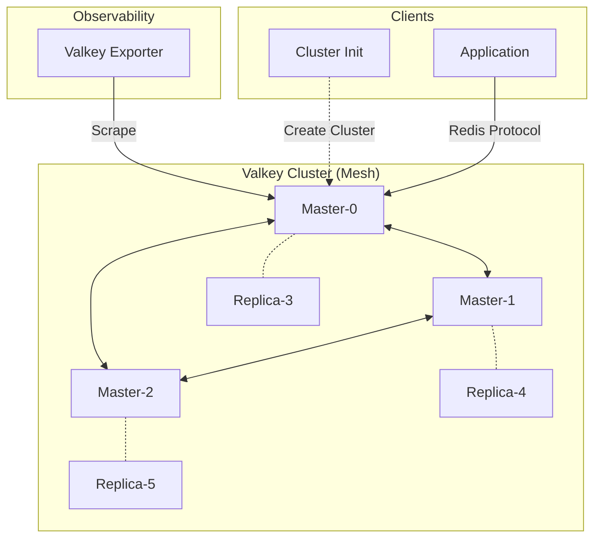

# Valkey Cluster

## Overview

**Valkey** is a high-performance open-source (Linux Foundation) alternative to Redis. This directory configures a distributed **6-node Cluster** (3 Masters, 3 Replicas) offering horizontal scalability and high availability.



## Services

| Service               | Image                        | Role                | Resources       |
| :-------------------- | :--------------------------- | :------------------ | :-------------- |
| `valkey-node-{0..5}`  | `valkey/valkey:9.0.1-alpine` | Data Node (Sharded) | 0.5 CPU / 512MB |
| `valkey-cluster-init` | `valkey/valkey:9.0.1`        | Bootstrap Script    | 0.1 CPU / 128MB |
| `valkey-exporter`     | `oliver006/redis_exporter`   | Prometheus Metrics  | 0.1 CPU / 128MB |

## Networking

Services run on `infra_net` with static IPs (`172.19.0.6X`).

| Service               | Static IP     | Internal Port             | Host Port                      |
| :-------------------- | :------------ | :------------------------ | :----------------------------- |
| `valkey-node-0`       | `172.19.0.60` | `${VALKEY0_PORT}`         | `${VALKEY0_PORT}`              |
| `valkey-node-1`       | `172.19.0.61` | `${VALKEY1_PORT}`         | `${VALKEY1_PORT}`              |
| `valkey-node-2`       | `172.19.0.62` | `${VALKEY2_PORT}`         | `${VALKEY2_PORT}`              |
| `valkey-node-3`       | `172.19.0.63` | `${VALKEY3_PORT}`         | `${VALKEY3_PORT}`              |
| `valkey-node-4`       | `172.19.0.64` | `${VALKEY4_PORT}`         | `${VALKEY4_PORT}`              |
| `valkey-node-5`       | `172.19.0.65` | `${VALKEY5_PORT}`         | `${VALKEY5_PORT}`              |
| `valkey-cluster-init` | `172.19.0.66` | -                         | -                              |
| `valkey-exporter`     | `172.19.0.67` | `${VALKEY_EXPORTER_PORT}` | `${VALKEY_EXPORTER_HOST_PORT}` |

## Persistence

| Volume                 | Description                             |
| :--------------------- | :-------------------------------------- |
| `valkey-data-{0..5}`   | Persists AOF/RDB data mapped to `/data` |
| `./config/valkey.conf` | Shared configuration file (Bind Mount)  |
| `./scripts/`           | Startup and Init scripts (Bind Mount)   |

## Configuration

- **Compatibility**: Valkey maintains 100% wire compatibility with Redis 7.2.4+.
- **Sharding**: Auto-provisioned by `valkey-cluster-init.sh` using `valkey-cli --cluster create`.
- **Password**: Managed via Docker Secret `valkey_password`.

## Usage

### Connecting (Internal)

Applications use standard Redis Cluster libraries.
Seed nodes: `valkey-node-0:6379`, `valkey-node-1:6380`, etc.

### Connecting (Debugging)

To manually interact with the cluster from the specific node:

```bash
# Connect to node-0
docker exec -it valkey-node-0 valkey-cli -c -a $(cat /run/secrets/valkey_password) -p 6379
```

_Note: The `-c` flag enables cluster mode redirection._

### Usage from Host

Similar to the Redis Cluster, Host ports are for debugging specific nodes only. Cluster redirection (MOVED errors) will return internal `172.19.x.x` IPs which are unreachable from the host without VPN/Tunneling.

## Troubleshooting

### "Cluster Down"

- Check `valkey-cluster-init` logs.
- Verify node health checks (`valkey-cli ping`).

### "MOVED Error"

- Ensure your client is "Cluster Aware".
- Do not use a standalone client for cluster operations.

## File Map

| Path                             | Description                                         |
| -------------------------------- | --------------------------------------------------- |
| `docker-compose.yml`             | 6-node Valkey cluster + init + exporter.            |
| `config/valkey.conf`             | Base Valkey cluster config (AOF/RDB, cluster mode). |
| `config/valkey.conf.example`     | Template config for Valkey.                         |
| `scripts/valkey-start.sh`        | Node entrypoint wrapper (announce/cluster ports).   |
| `scripts/valkey-cluster-init.sh` | Cluster creation once nodes are healthy.            |
| `README.md`                      | Architecture and usage notes.                       |
