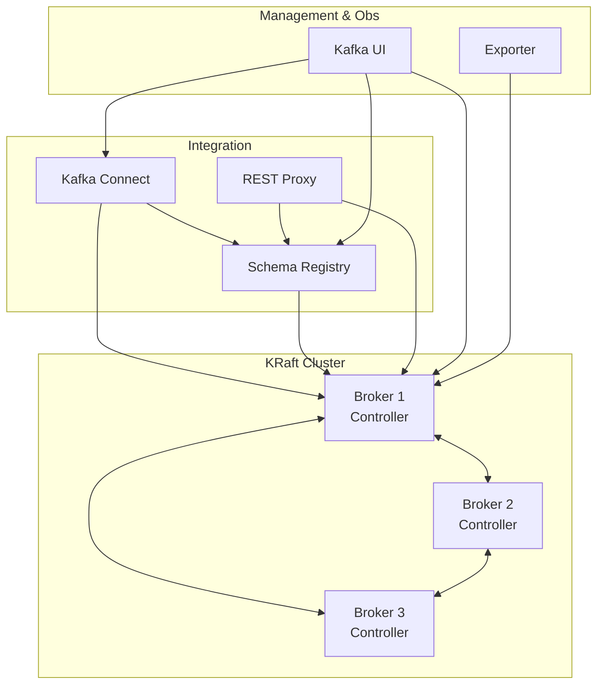

# Kafka Cluster (KRaft Mode)

## Overview

A robust, production-grade **3-node Kafka Cluster** running in **KRaft mode** (ZooKeeper-less). This deployment integrates the full Confluent Platform ecosystem, including Schema Registry, Connect, REST Proxy, and advanced monitoring.



## Services

| Service            | Image                                   | Role                           | Resources       |
| :----------------- | :-------------------------------------- | :----------------------------- | :-------------- |
| `kafka-{1,2,3}`    | `confluentinc/cp-kafka:8.1.1`           | Combined Broker & Controller   | 1 CPU / 1GB     |
| `schema-registry`  | `confluentinc/cp-schema-registry:8.1.1` | Schema Management (Avro/Proto) | 512MB RAM       |
| `kafka-connect`    | `confluentinc/cp-kafka-connect:8.1.1`   | Distributed Connector Worker   | 1 CPU / 1.5GB   |
| `kafka-rest-proxy` | `confluentinc/cp-kafka-rest:8.1.1`      | HTTP API for Kafka             | 0.5 CPU / 512MB |
| `kafka-ui`         | `provectuslabs/kafka-ui:v0.7.2`         | Web Management Interface       | 0.5 CPU / 512MB |
| `kafka-exporter`   | `danielqsj/kafka-exporter:v1.9.0`       | Prometheus Metrics Exporter    | 0.1 CPU / 128MB |

## Networking

Services run on `infra_net` with static IPs (`172.19.0.2X`).

| Service            | Static IP     | Port (Internal) | Port (Host)                       | Traefik Domain                   |
| :----------------- | :------------ | :-------------- | :-------------------------------- | :------------------------------- |
| `kafka-1`          | `172.19.0.20` | `19092`, `9093` | `${KAFKA_CONTROLLER_1_HOST_PORT}` | -                                |
| `kafka-2`          | `172.19.0.21` | `19092`, `9093` | `${KAFKA_CONTROLLER_2_HOST_PORT}` | -                                |
| `kafka-3`          | `172.19.0.22` | `19092`, `9093` | `${KAFKA_CONTROLLER_3_HOST_PORT}` | -                                |
| `schema-registry`  | `172.19.0.23` | `8081`          | `${SCHEMA_REGISTRY_PORT}`         | `schema-registry.${DEFAULT_URL}` |
| `kafka-connect`    | `172.19.0.24` | `8083`          | -                                 | `kafka-connect.${DEFAULT_URL}`   |
| `kafka-rest-proxy` | `172.19.0.25` | `8082`          | -                                 | `kafka-rest.${DEFAULT_URL}`      |
| `kafka-ui`         | `172.19.0.26` | `8080`          | `${KAFKA_UI_PORT}`                | `kafka-ui.${DEFAULT_URL}`        |
| `kafka-exporter`   | `172.19.0.27` | `9308`          | -                                 | -                                |

## Configuration

### KRaft Environment Variables

| Variable                         | Description       | Value                              |
| :------------------------------- | :---------------- | :--------------------------------- |
| `CLUSTER_ID`                     | Unique Cluster ID | `${KAFKA_CLUSTER_ID}`              |
| `KAFKA_PROCESS_ROLES`            | Server Role       | `broker,controller`                |
| `KAFKA_CONTROLLER_QUORUM_VOTERS` | Voter List        | `1@kafka-1:9093,2@kafka-2:9093...` |
| `KAFKA_HEAP_OPTS`                | JVM Heap          | `-Xms512m -Xmx512m`                |

### Replication Defaults

- **Replication Factor**: `3` (High Availability)
- **Min In-Sync Replicas**: `2` (Data Durability)
- **Log Directions**: `/var/lib/kafka/data`

## Usage

### 1. Accessing Kafka UI

- **URL**: `https://kafka-ui.${DEFAULT_URL}`
- **Login**: Protected by SSO. Provides full cluster management (Topics, Connectors, Schemas).

### 2. CLI Operations

Create a topic:

```bash
docker exec kafka-1 kafka-topics --bootstrap-server localhost:19092 \
  --create --topic my-topic --partitions 3 --replication-factor 3
```

List topics:

```bash
docker exec kafka-1 kafka-topics --bootstrap-server localhost:19092 --list
```

Consume messages:

```bash
docker exec kafka-1 kafka-console-consumer --bootstrap-server localhost:19092 \
  --topic my-topic --from-beginning
```

### 3. Kafka Connect

Check installed plugins:

```bash
curl http://localhost:8083/connector-plugins | jq
```

Deploy a connector (Example):

```bash
curl -X POST -H "Content-Type: application/json" --data @my-connector.json \
  http://localhost:8083/connectors
```

## Observability (Prometheus + Grafana)

Kafka broker metrics are exposed via **JMX Exporter** on port `9404` (inside `infra_net`).
Prometheus scrapes those endpoints and Grafana dashboards expect the **job label** to be `kafka`.

- **Prometheus targets**: `kafka-1:9404`, `kafka-2:9404`, `kafka-3:9404`
- **Prometheus job name**: `kafka`
- **Grafana**: Kafka dashboards query with `job="kafka"`

If metrics are not visible in Grafana, first confirm the Prometheus job label matches:

```bash
# Inside the Prometheus container
wget -qO- 'http://localhost:9090/api/v1/query?query=up%7Bjob%3D%22kafka%22%7D'
```

If the response is empty but JMX targets are up, the scrape job name is likely mismatched.
Update `infra/06-observability/prometheus/config/prometheus.yml` to use `job_name: "kafka"` and reload Prometheus.

## Troubleshooting

### "Inconsistent Cluster ID"

If you see errors about `CLUSTER_ID` mismatch in logs:

1. Stop the cluster: `docker compose down`
2. Remove volumes: `docker volume rm infra_kafka-1-data infra_kafka-2-data infra_kafka-3-data`
3. Restart: `docker compose up -d`

**\*Note**: This deletes all data! Ensure `KAFKA_CLUSTER_ID` in `.env` remains constant.\*

### Broker Not Joining

Check `KAFKA_CONTROLLER_QUORUM_VOTERS`. All nodes must list the exact same voters string.

### Connect Worker OOM

Kafka Connect is memory intensive. If it crashes, increase the memory limit in `docker-compose.yml` (currently `1.5G`).

### Grafana Kafka Dashboard Shows No Data

**Symptom**: Grafana dashboards show empty panels even though Kafka is running.

**Cause**: Prometheus scrape job name does not match Grafana's `job="kafka"` filter.

**Fix**:

1. Ensure Prometheus uses `job_name: "kafka"` for the Kafka JMX scrape targets.
2. Reload Prometheus configuration.
3. Refresh Grafana dashboards.

## File Map

| Path                 | Description                                             |
| -------------------- | ------------------------------------------------------- |
| `docker-compose.yml` | KRaft Kafka cluster + Confluent components + exporters. |
| `README.md`          | Architecture, ports, and operations.                    |
