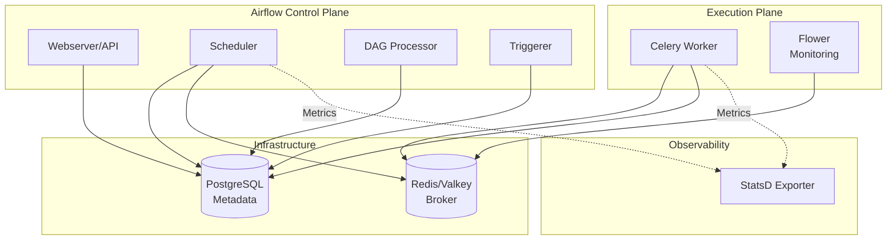

# Apache Airflow

## Overview

A platform to programmatically author, schedule, and monitor workflows. This deployment uses the **CeleryExecutor** architecture for distributed task execution, allowing for high availability and scalability.

## Profiles

- `airflow`: Base Airflow stack (scheduler, webserver, workers).
- `flower`: Optional Celery monitoring UI.
- `debug`: Optional debug webserver and extra tooling.

```bash
docker compose --profile airflow up -d
docker compose --profile airflow --profile flower up -d
```



## Services

| Service | Role | Resources | Port |
| :--- | :--- | :--- | :--- |
| `airflow-apiserver` | Web UI & API Server | 1 CPU / 1GB | `${AIRFLOW_PORT}` (8080) |
| `airflow-scheduler` | Schedules tasks to be executed | 1 CPU / 1GB | - |
| `airflow-worker` | Executes the tasks (Celery) | 1 CPU / 1GB | - |
| `airflow-triggerer` | Async execution support | 1 CPU / 1GB | - |
| `airflow-dag-processor`| Parses DAG files | 1 CPU / 1GB | - |
| `flower` | Celery monitoring tool | 1 CPU / 1GB | `${FLOWER_PORT}` (5555) |
| `airflow-statsd-exporter` | Metrics for Prometheus | 0.1 CPU / 128MB | 9102 (HTTP) |

## Networking

All services run on `infra_net` and rely on shared infrastructure.

| Service | Static IP | Traefik Domain |
| :--- | :--- | :--- |
| `airflow-apiserver` | Dynamic | `airflow.${DEFAULT_URL}` |
| `flower` | Dynamic | `flower.${DEFAULT_URL}` |

### External Dependencies

- **PostgreSQL**: Metadata Database (via `postgresql-cluster` or `mng-db`)
- **Redis/Valkey**: Celery Message Broker (via `valkey-cluster` or `mng-valkey`)

## Persistence

| Volume | Mount Point | Description |
| :--- | :--- | :--- |
| `airflow-dags` | `/opt/airflow/dags` | DAG definition files |
| `airflow-plugins` | `/opt/airflow/plugins` | Custom plugins |
| `airflow-logs` | `/opt/airflow/logs` | Task and scheduler logs |
| `airflow-config` | `/opt/airflow/config` | Airflow configuration files |
| `./config/statsd_mapping.yml` | `/tmp/mappings.yml` | Metrics mapping config |

## Configuration

### Core Environment Variables

| Variable | Description | Default |
| :--- | :--- | :--- |
| `AIRFLOW__CORE__EXECUTOR` | Execution Mode | `CeleryExecutor` |
| `AIRFLOW__CORE__DAGS_ARE_PAUSED_AT_CREATION` | Auto-pause DAGs | `true` |
| `AIRFLOW__CORE__LOAD_EXAMPLES` | Load Example DAGs | `true` |
| `AIRFLOW__WEBSERVER__BASE_URL` | Public URL | `https://airflow.${DEFAULT_URL}` |
| `AIRFLOW_UID` | Process User ID | `50000` |

### Database & Broker

| Variable | Description |
| :--- | :--- |
| `AIRFLOW__DATABASE__SQL_ALCHEMY_CONN` | `postgresql+psycopg2://${USER}:${PASS}@${HOST}:${PORT}/airflow` |
| `AIRFLOW__CELERY__BROKER_URL` | `redis://:${PASS}@${HOST}:${PORT}/0` |

### Metrics (StatsD)

Airflow pushes metrics to the local `airflow-statsd-exporter` via UDP, which exposes them for Prometheus.

- `AIRFLOW__METRICS__STATSD_ON`: `true`
- `AIRFLOW__METRICS__STATSD_HOST`: `airflow-statsd-exporter`
- `AIRFLOW__METRICS__STATSD_PORT`: `8125`

## Usage

### 1. Web Access

- **Airflow UI**: `https://airflow.${DEFAULT_URL}`
  - Credentials: `${_AIRFLOW_WWW_USER_USERNAME}` / `${_AIRFLOW_WWW_USER_PASSWORD}`
- **Flower UI**: `https://flower.${DEFAULT_URL}`
  - Protected by SSO (Traefik middleware) due to lack of built-in auth.

### 2. CLI Commands

Use the `airflow-cli` service or `exec` into `airflow-scheduler` to run commands.

```bash
# List all DAGs
docker compose run --rm airflow-cli airflow dags list

# Trigger a DAG
docker compose run --rm airflow-cli airflow dags trigger example_dag

# Check config
docker compose run --rm airflow-cli airflow config list
```

### 3. Adding DAGs

Place your python DAG files in the global DAGs volume (or mapped host directory if configured).
If using the default volume:

```bash
# Copy local DAG to container volume
docker cp ./my_dag.py airflow-scheduler:/opt/airflow/dags/
```

## Troubleshooting

### "Database is locked" or Migration Fails

If `airflow-init` hangs or fails, ensure the PostgreSQL database is healthy and reachable.
Check logs:

```bash
docker compose logs airflow-init
```

### Scheduler Not Warning Tasks

Check if the Scheduler is running and healthy:

```bash
docker compose ps airflow-scheduler
docker compose logs airflow-scheduler
```

### Worker Not Picking Up Tasks

1. Check Celery connection to Redis.
2. Verify `AIRFLOW__CELERY__BROKER_URL` matches the active Redis/Valkey service.
3. Check Flower UI to see if workers are online.

## File Map

| Path | Description |
| --- | --- |
| `docker-compose.yml` | Airflow CeleryExecutor stack (default broker). |
| `docker-compose.redis.yml` | Alternate compose with Redis-specific wiring. |
| `config/statsd_mapping.yml` | StatsD → Prometheus metric mapping rules. |
| `README.md` | Architecture, config, and usage notes. |
