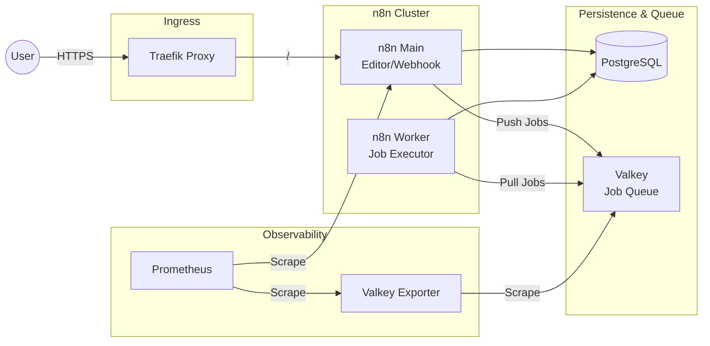

# n8n (Workflow Automation)

## Overview

**n8n** is an extendable workflow automation tool that enables you to connect anything to everything via its node-based interface. This deployment is configured in **Queue Mode** (Distributed Architecture) to handle high-volume workloads by separating the Editor/Webhook handling from the actual execution processing using Workers.



## Services

| Service | Image | Role | Resources |
| :--- | :--- | :--- | :--- |
| `n8n` | `n8nio/n8n:2.3.0` | Main Node (UI, API, Webhooks) | 1.0 CPU / 2GB |
| `n8n-worker` | `n8nio/n8n:2.3.0` | Worker Node (Workflow Execution) | 1.0 CPU / 2GB |
| `n8n-valkey` | `valkey/valkey:9.0.1-alpine` | High-Performance Job Queue | 0.5 CPU / 256MB |
| `n8n-valkey-exporter` | `oliver006/redis_exporter` | Prometheus Metrics | 0.1 CPU / 128MB |

## Networking

All services are connected to the `infra_net` network with static IPs for consistent metrics collection and internal communication.

| Service | Static IP | Internal Port | Traefik Domain |
| :--- | :--- | :--- | :--- |
| `n8n` | `172.19.0.14` | `${N8N_PORT}` (5678) | `n8n.${DEFAULT_URL}` |
| `n8n-worker` | `172.19.0.17` | - | - |
| `n8n-valkey` | `172.19.0.15` | `6379` | - |
| `n8n-valkey-exporter` | `172.19.0.16` | `9121` | - |

## Persistence

| Volume | Mount Point | Description |
| :--- | :--- | :--- |
| `n8n-data` | `/home/node/.n8n` | Stores workflows, credentials, and binary files. |
| `n8n-custom` | `/home/node/.n8n/custom` | (Bind Mount) Local `infra/n8n/custom` directory for developing Private Nodes. |
| `n8n-valkey-data` | `/data` | Redis-compatible AOF persistence for the job queue. |

## Configuration

### Queue Mode & Secrets

n8n uses **Valkey** (Redis-compatible) as the message broker for Bull queues. The connection is secured via Docker Secrets.

- **Queue Host**: `n8n-valkey`
- **Secret**: `valkey_password` (mounted at `/run/secrets/valkey_password`)

### Database (PostgreSQL)

A dedicated `n8n` database on the management PostgreSQL instance is used for operational data.

- **Host**: `${POSTGRES_HOSTNAME}`
- **Database**: `n8n`

## Custom Build (Fonts & Dependencies)

This directory features a custom **Multi-stage Dockerfile** designed to overcome the limitations of the official distroless image.

### Multi-stage Build Workflow

1. **Stage 1 (Builder)**: Uses `alpine:3.21` to install TTF fonts (`font-noto`, `ttf-dejavu`, etc.) and build caches.
2. **Stage 2 (Final)**:
   - Copies pre-compiled fonts from the builder.
   - Installs **Python 3** and build dependencies (`make`, `g++`, etc.) for `Execute Command` nodes.
   - Installs `n8n-cli` globally.
   - Sets up the `custom/` directory for **Private Custom Nodes**.
3. **Result**: A production-ready image with Korean fonts, Python runtime, and custom node support.

### Build and Run

```bash
# Build custom image with fonts
docker compose build n8n

# Start the full stack
docker compose up -d
```

## Usage

### 1. Scaling Workers

Scale the execution capacity horizontally if the job queue length grows:

```bash
docker compose up -d --scale n8n-worker=3
```

### 2. Monitoring the Queue

```bash
# Check queue length directly in Valkey
docker exec -it n8n-valkey valkey-cli -a $(cat /run/secrets/valkey_password) LLEN n8n:bull:jobs:wait
```

## Troubleshooting

### "Workflow Loop Detected"

Ensure `N8N_PROXY_HOPS` is set correctly (default: 1) if using multiple layers of proxies.

### "PDF/Image Rendering Issues"

Verify that the custom build was successful and fonts are available in `/usr/share/fonts` within the container.

## File Map

| Path | Description |
| --- | --- |
| `docker-compose.yml` | n8n + Valkey queue stack (default). |
| `docker-compose.redis.yml` | Redis-based alternative stack. |
| `Dockerfile` | Custom n8n image (fonts, Python, n8n-cli). |
| `custom/` | Private/custom nodes (bind-mounted into the container). |
| `README.md` | Queue-mode architecture and operations. |
