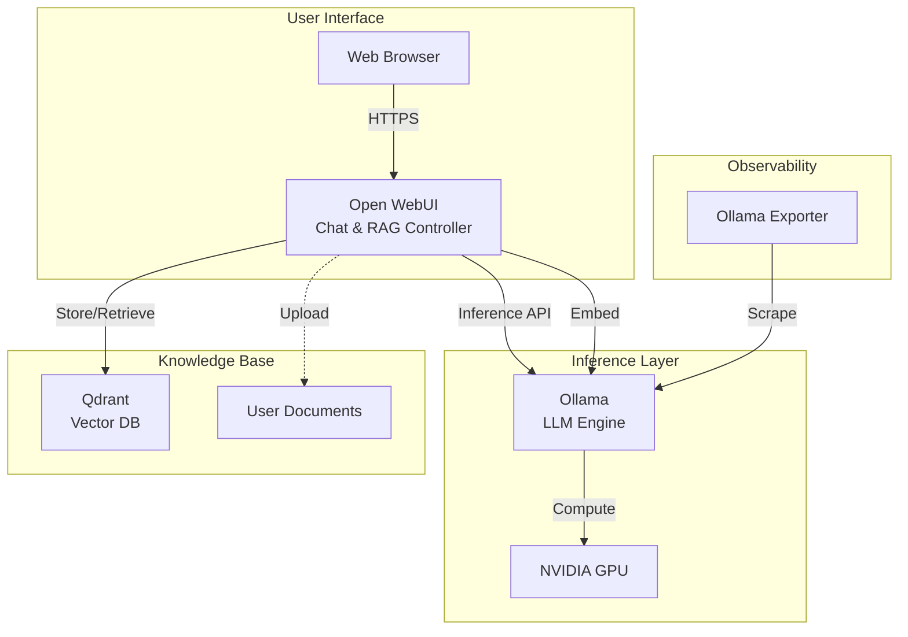

# Ollama & Open WebUI

## Overview

A private, local **LLM AI Stack** capable of running large language models like Llama 3, Mistral, and Gemma offline. It includes **Open WebUI** for a ChatGPT-like experience and **RAG (Retrieval-Augmented Generation)** capabilities using Qdrant as the vector store.

## Profile

This stack is **optional** and runs under the `ollama` profile.

```bash
docker compose --profile ollama up -d ollama open-webui
```



## Services

| Service | Image | Role | Resources |
| :--- | :--- | :--- | :--- |
| `ollama` | `ollama/ollama:0.13.5` | LLM Inference Server | 4 CPU / 8GB RAM / 1 GPU |
| `open-webui` | `ghcr.io/open-webui/open-webui:main` | Chat UI & RAG Orchestrator | 1 CPU / 1GB RAM |
| `ollama-exporter` | `lucabecker42/ollama-exporter:latest` | Metrics Exporter | 0.1 CPU / 128MB |

## Networking

Services run on `infra_net` with static IPs.

| Service | Static IP | Port (Internal) | Host Port | Traefik Domain |
| :--- | :--- | :--- | :--- | :--- |
| `ollama` | `172.19.0.40` | `11434` | `${OLLAMA_PORT}` | `ollama.${DEFAULT_URL}` |
| `open-webui` | `172.19.0.42` | `8080` | - | `chat.${DEFAULT_URL}` |
| `ollama-exporter` | `172.19.0.43` | `11434` (Mock) | `${OLLAMA_EXPORTER_HOST_PORT}` | - |

## Persistence

| Volume | Mount Point | Description |
| :--- | :--- | :--- |
| `ollama-data` | `/root/.ollama` | Stores downloaded model globs. |
| `ollama-webui` | `/app/backend/data` | Chat history, login data, uploaded RAG docs. |

## Configuration

### Hardware Requirements

- **GPU**: NVIDIA GPU with `nvidia-container-toolkit` installed on host.
- **CPU**: AVX2 support required if running CPU-only mode.
- **RAM**: At least 8GB dedicated to Docker recommended for 7B models.

### Environment Variables

| Variable | Service | Description | Value |
| :--- | :--- | :--- | :--- |
| `OLLAMA_HOST` | Ollama | Listen address | `0.0.0.0:${OLLAMA_PORT}` |
| `NVIDIA_VISIBLE_DEVICES` | Ollama | GPU Isolation | `all` |
| `OLLAMA_BASE_URL` | WebUI | Connection to backend | `http://ollama:${OLLAMA_PORT}` |
| `VECTOR_DB_URL` | WebUI | Connection to Qdrant | `http://qdrant:${QDRANT_PORT}` |
| `RAG_EMBEDDING_ENGINE` | WebUI | Embedding Provider | `ollama` |

## RAG Workflow (Retrieval Augmented Generation)

1. **Ingestion**: User uploads a PDF/TXT to Open WebUI.
2. **Embedding**: WebUI sends text chunks to Ollama (`qwen3-embedding`) to convert text to vectors.
3. **Storage**: Vectors are stored in Qdrant (`172.19.0.41`).
4. **Retrieval**: When User asks a question, WebUI searches Qdrant for relevant context.
5. **Generation**: context + question is sent to Ollama (`llama3`) to generate the answer.

## Usage

### 1. Model Setup (Required First Time)

You must download models before chatting.

**Via CLI**:

```bash
# Chat Model
docker exec -it ollama ollama pull llama3

# Embedding Model (Required for RAG)
docker exec -it ollama ollama pull qwen3-embedding:0.6b
```

**Via Web UI**:
Go to **Admin Panel > Settings > Models** and pull `llama3` and associated embedding models from the interface.

### 2. Accessing Interfaces

- **Chat UI**: `https://chat.${DEFAULT_URL}`
- **API**: `https://ollama.${DEFAULT_URL}`

### 3. GPU Verification

To confirm Ollama is using your GPU:

```bash
docker exec -it ollama nvidia-smi
```

*You should see a process utilizing VRAM.*

## Troubleshooting

### "GPU Not Found"

- Ensure `nvidia-smi` works on the host.
- Verify `deploy.resources.reservations.devices` is enabled in `docker-compose.yml`.

### "RAG Not Working"

- Check if `qwen3-embedding:0.6b` (or your configured `RAG_EMBEDDING_MODEL`) is actually pulled.
- Verify connectivity to **Qdrant** (`http://qdrant:6333` from WebUI container).

## File Map

| Path | Description |
| --- | --- |
| `docker-compose.yml` | Ollama + Open WebUI + exporter stack. |
| `README.md` | Model/RAG usage and GPU notes. |
