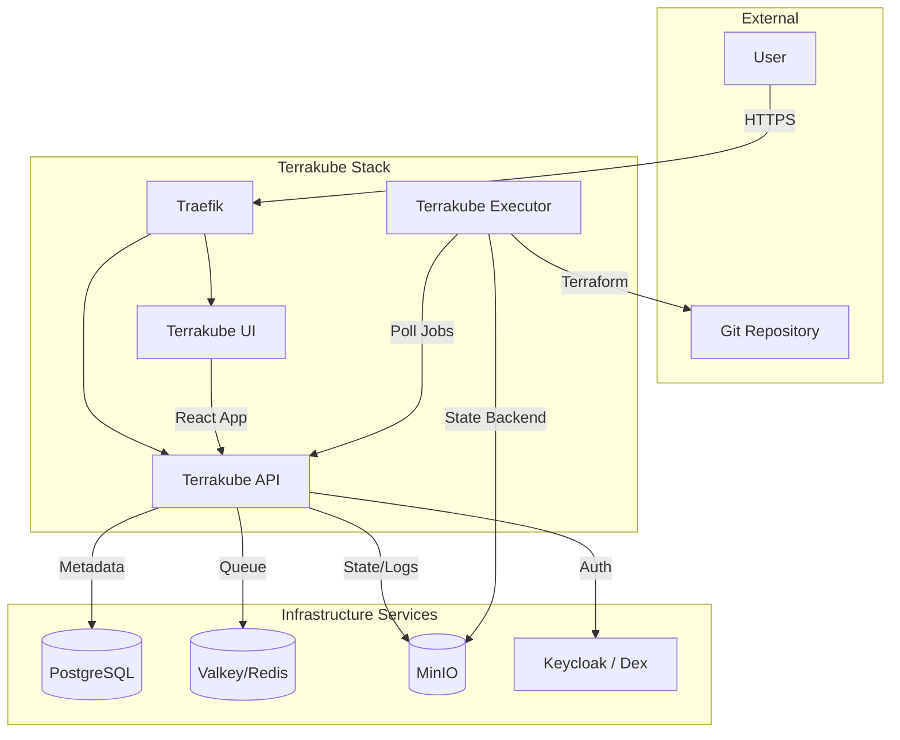

# Terrakube

## Overview

**Terrakube** is an open-source Infrastructure as Code (IaC) management platform that serves as an alternative to Terraform Cloud/Enterprise. It orchestrates Terraform runs (Plan/Apply) and manages state files securely.

## Profile

This stack is **optional** and runs under the `terrakube` profile.

```bash
docker compose --profile terrakube up -d
```



## Services

| Service              | Image                           | Role                          | Port (Internal)              |
| :------------------- | :------------------------------ | :---------------------------- | :--------------------------- |
| `terrakube-api`      | `azbuilder/api-server:2.29.0`   | Core Logic & State Management | `8080`                       |
| `terrakube-ui`       | `azbuilder/terrakube-ui:2.29.0` | Web Dashboard                 | `${TERRAKUBE_UI_PORT}`       |
| `terrakube-executor` | `azbuilder/executor:2.29.0`     | Runner (Executes Terraform)   | `${TERRAKUBE_EXECUTOR_PORT}` |

## Networking

All services run on `infra_net` with **Dynamic IPs**.

| Service      | Host Rule                           | Internal Port                |
| :----------- | :---------------------------------- | :--------------------------- |
| **API**      | `terrakube-api.${DEFAULT_URL}`      | `8080`                       |
| **UI**       | `terrakube-ui.${DEFAULT_URL}`       | `${TERRAKUBE_UI_PORT}`       |
| **Executor** | `terrakube-executor.${DEFAULT_URL}` | `${TERRAKUBE_EXECUTOR_PORT}` |

## Dependencies (External)

Terrakube relies heavily on shared infrastructure services:

- **Database**: `mng-pg` (Shared PostgreSQL in `infra/mng-db`)
- **Cache**: `mng-redis` (Shared Valkey in `infra/mng-db`)
- **Storage**: `minio` (S3 Compatible Storage in `infra/minio`)
- **Identity**: `keycloak` (via Dex protocols)

## Configuration

### Environment Variables

| Component    | Variable                      | Description                           |
| :----------- | :---------------------------- | :------------------------------------ |
| **Common**   | `InternalSecret`              | Shared secret for inter-service comms |
| **API**      | `ApiDataSourceType`           | `POSTGRESQL`                          |
|              | `StorageType`                 | `AWS` (MinIO S3)                      |
|              | `GroupValidationType`         | `DEX` (Identity Provider)             |
| **UI**       | `REACT_APP_TERRAKUBE_API_URL` | Public Endpoint for API               |
| **Executor** | `ExecutorFlagBatch`           | `false` (Run as daemon)               |

### Executor Privileges

The Executor mounts `/var/run/docker.sock` to spawn ephemeral Terraform runner containers or to manage Docker resources directly.

## Usage

### 1. Web Dashboard

- **URL**: `https://terrakube-ui.${DEFAULT_URL}`
- **Login**: Redirects to Keycloak for authentication.

### 2. CLI authentication

You can use the output from the UI to configure your Terraform CLI backend or generate Personal Access Tokens (PAT).

## Troubleshooting

### "Executor not picking up jobs"

- Check the `InternalSecret` matches between API and Executor.
- Ensure `terrakube-executor` can resolve `terrakube-api` (Docker DNS).

### "State Locking Issues"

- Verify connection to `mng-redis` (Valkey).
- Check `terrakube-api` logs for Redis connection errors.

## File Map

| Path                 | Description                                    |
| -------------------- | ---------------------------------------------- |
| `docker-compose.yml` | Terrakube API/UI/Executor stack definition.    |
| `secrets/certs/`     | TLS assets (if enabled for internal services). |
| `README.md`          | Usage and dependency notes.                    |
