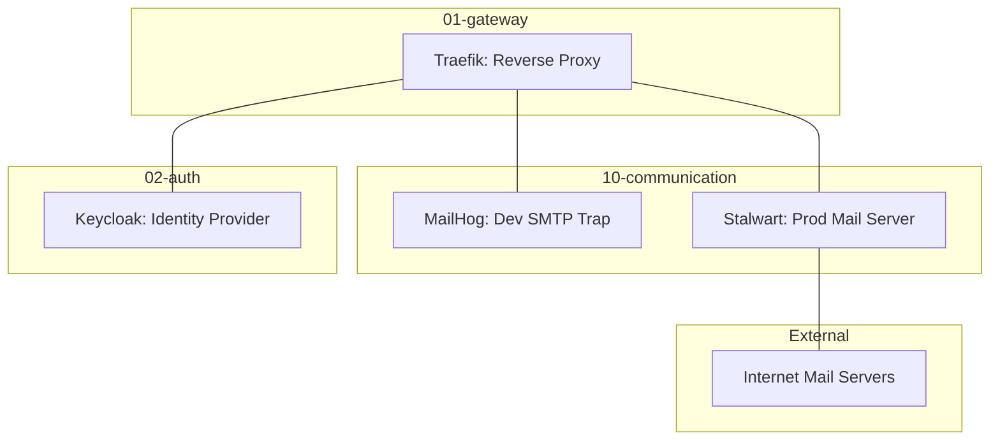

# 10-communication - Communication Tier

## Overview

`10-communication` 계층은 시스템의 전자우편 수발신 및 개발 단계의 안전한 메일 트래핑(Trapping) 환경을 제공한다. 현재 구현은 root optional/commented include인 `mail` leaf로 구성되며 Stalwart와 MailHog를 핵심 구성 요소로 사용한다.

## Architecture

### Component Diagram



- **MailHog**: 개발 모드에서 모든 아웃바운드 SMTP 연결을 캡처하여 메모리에 보관.
- **Stalwart**: 운영 모드에서 JMAP, IMAP, SMTP 프로토콜을 통한 실제 메일 수발신 처리.

## Integration

### Upstream Dependencies

- **02-auth**: Traefik SSO 미들웨어를 통한 관리 UI 접근 제어.
- **01-gateway**: Traefik을 통한 가상 호스트 라우팅.

### Downstream Consumers

- **Applications**: 시스템 알림, 비밀번호 재설정 메일 등 SMTP 클라이언트로 연동.
- **Developers**: Web UI를 통한 메일 발송 결과 실시간 모니터링.

## Operations

### Deployment

이 tier의 root include는 현재 optional/commented 상태다. static readiness는 다음 기준으로 확인한다.

```bash
bash scripts/hardening/check-all-hardening.sh 10-communication
```

runtime 시작/중지는 root include 활성화와 운영 승격 evidence가 준비된 뒤 승인된 절차로 수행한다.

### Key Ports

- **MailHog SMTP (internal)**: 1025
- **Stalwart Mail Ports (host-bound)**: 25, 465, 587, 993, 4190
- **Web UI (Traefik route)**: 8025 target for MailHog, 8080 target for Stalwart Admin/JMAP

## Governance

### Standard Compliance

- **Architecture**: March 2026 "Thin Root" 규격을 준수한다.
- **Documentation**: [docs/README.md](../../docs/README.md) 기반의 Stage-Gate Taxonomy를 따른다.

### Related Documents

- [PRD](../../docs/01.requirements/2026-03-26-10-communication.md)
- [ARD](../../docs/02.architecture/requirements/0010-communication-architecture.md)
- [ADR](../../docs/02.architecture/decisions/0010-communication-services.md)
- [Technical Spec](../../docs/03.specs/10-communication/spec.md)
- [Guide](../../docs/05.operations/guides/10-communication/mail.md)
- [Policy](../../docs/05.operations/policies/10-communication/mail.md)
- [Runbook](../../docs/05.operations/runbooks/10-communication/mail.md)

---

## Audience

이 README의 주요 독자:

- Developers
- Operators
- Documentation Writers
- AI Agents

## Scope

### In Scope

- Compose 서비스 정의와 관련 설정 설명
- 서비스별 README와 운영 문서 연결
- 검증 시 참고해야 할 구성 파일 인벤토리

### Out of Scope

- secret 값 원문
- 사용자 승인 없는 runtime 동작 변경
- 다른 tier의 서비스 정책 중복 정의

## Structure

```text
infra/10-communication/
├── mail/  # 하위 구성 영역
└── README.md  # This file
```

## How to Work in This Area

1. 상위 tier README와 해당 서비스의 `docker-compose*.yml` 또는 설정 파일을 먼저 확인한다.
2. 새 문서나 README를 만들 때는 `docs/99.templates/`의 대응 템플릿을 따른다.
3. 변경 후 상위 README와 관련 stage 문서의 링크를 함께 확인한다.
4. secret 값, token, 인증서 원문은 문서에 쓰지 않는다.

## Related Documents

- [infra/README.md](../README.md)
- [docs/05.operations/README.md](../../docs/05.operations/README.md)
- [Mail operations guide](../../docs/05.operations/guides/10-communication/mail.md)
- [Mail operations policy](../../docs/05.operations/policies/10-communication/mail.md)
- [Mail recovery runbook](../../docs/05.operations/runbooks/10-communication/mail.md)
