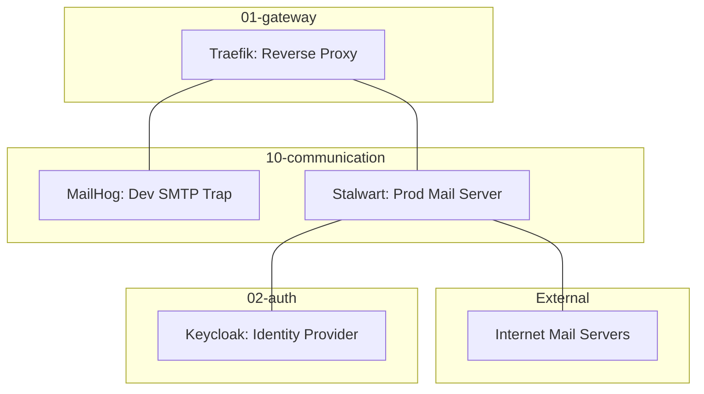

# 10-communication - Communication Tier

## Overview

`10-communication` 계층은 시스템의 고성능 전자우편 수발신 및 개발 단계의 안전한 메일 트래핑(Trapping) 환경을 제공한다. Rust 기반의 현대적인 메일 서버인 Stalwart와 개발용 샌드박스인 MailHog를 핵심 구성 요소로 사용한다.

## Architecture

### Component Diagram



- **MailHog**: 개발 모드에서 모든 아웃바운드 SMTP 연결을 캡처하여 메모리에 보관.
- **Stalwart**: 운영 모드에서 JMAP, IMAP, SMTP 프로토콜을 통한 실제 메일 수발신 처리.

## Integration

### Upstream Dependencies

- **02-auth**: Keycloak을 통한 관리자 및 사용자 계정 통합 인증 (OIDC/LDAP).
- **01-gateway**: Traefik을 통한 SSL/TLS 종단 및 가상 호스트 라우팅.

### Downstream Consumers

- **Applications**: 시스템 알림, 비밀번호 재설정 메일 등 SMTP 클라이언트로 연동.
- **Developers**: Web UI를 통한 메일 발송 결과 실시간 모니터링.

## Operations

### Deployment

```bash
# 서비스 시작
docker compose up -d

# 로그 확인
docker compose logs -f
```

### Key Ports

- **SMTP (Dev)**: 1025
- **SMTP (Prod)**: 25, 465, 587
- **Web UI**: 8025 (MailHog), 8080 (Stalwart Admin)

## Governance

### Standard Compliance

- **Architecture**: March 2026 "Thin Root" 규격을 준수한다.
- **Documentation**: [docs/README.md](../../docs/README.md) 기반의 Stage-Gate Taxonomy를 따른다.

### Related Documents

- [PRD](../../docs/01.prd/2026-03-26-10-communication.md)
- [ARD](../../docs/02.ard/0010-communication-architecture.md)
- [ADR](../../docs/03.adr/0010-communication-services.md)
- [Technical Spec](../../docs/04.specs/10-communication/spec.md)
