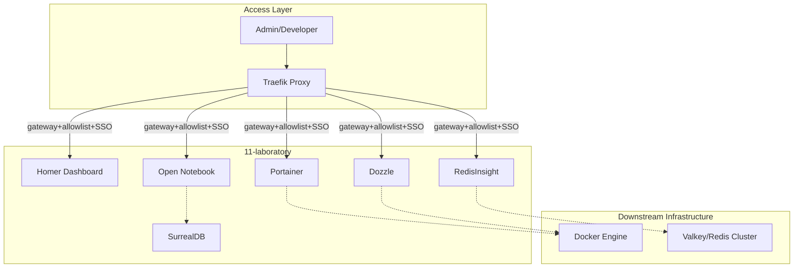

# 11-laboratory - Management & Laboratory Tier

## Overview

`11-laboratory` 계층은 시스템 관리, 리소스 시각화 및 실험적 도구들을 위한 통합 관리 환경을 제공한다. 현재 root-active 서비스는 Dozzle, RedisInsight, Open Notebook, SurrealDB이며 Homer Dashboard와 Portainer는 optional/commented root include로 유지된다.

## Architecture

### Component Diagram



- **Homer**: 인프라 전용 서비스 진입점 대시보드.
- **Portainer**: 시각적 컨테이너 오케스트레이션 및 상태 관리.
- **RedisInsight**: 데이터 저장소(Valkey/Redis)의 데이터 탐색 및 성능 분석.
- **Dozzle**: 실시간 컨테이너 로그 스트리밍 및 모니터링.
- **Open Notebook**: 로컬 지식 작업과 SurrealDB-backed 실험성 노트북 환경.

## Integration

### Upstream Dependencies

- **02-auth**: Traefik SSO middleware를 통한 통합 인증 및 접근 제어.
- **01-gateway**: Traefik 리버스 프록시를 이용한 보안 라우팅.

### Downstream Consumers

- **Administrators**: 전체 인프라 상태 및 컨테이너 리소스 관리.
- **Developers**: 데이터베이스 조회 및 서비스 접근 경로 확인.

## Operations

### Deployment

```bash
HYHOME_COMPOSE_PROFILES=admin bash scripts/validation/validate-docker-compose.sh
bash scripts/hardening/check-all-hardening.sh 11-laboratory
```

Runtime start/stop은 root include 활성 상태와 운영자 승인 범위를 확인한 뒤 수행한다. Service-local standalone compose rendering은 root `infra_net`, secret, common template context를 보존하지 못하므로 readiness evidence로 사용하지 않는다.

### Key Ports

- **Dashboard**: `homer.${DEFAULT_URL}` -> Homer internal `${HOMER_PORT:-8080}` (optional root include)
- **Container UI**: `portainer.${DEFAULT_URL}` -> Portainer internal `${PORTAINER_PORT:-9443}` (optional root include)
- **Logs UI**: `dozzle.${DEFAULT_URL}` -> Dozzle internal `${DOZZLE_PORT:-8080}` (root-active)
- **Data UI**: `redisinsight.${DEFAULT_URL}` -> RedisInsight internal `${REDIS_INSIGHT_PORT:-5540}` (root-active)
- **Notebook UI**: `open-notebook.${DEFAULT_URL}` -> Open Notebook web internal `${OPEN_NOTEBOOK_WEB_URL:-8502}` (root-active)

## Governance

### Standard Compliance

- **Architecture**: March 2026 "Thin Root" 규격을 준수한다.
- **Documentation**: [docs/README.md](../../docs/README.md) 기반의 Stage-Gate Taxonomy를 따른다.

### Related Documents

- [PRD](../../docs/01.requirements/012-laboratory.md)
- [ARD](../../docs/02.architecture/requirements/0011-laboratory-architecture.md)
- [ADR](../../docs/02.architecture/decisions/0011-laboratory-services.md)
- [Technical Spec](../../docs/03.specs/012-laboratory/spec.md)
- [Operations guide](../../docs/05.operations/guides/11-laboratory/README.md)
- [Operations policy](../../docs/05.operations/policies/11-laboratory/README.md)
- [Operations runbook](../../docs/05.operations/runbooks/11-laboratory/README.md)

---

## Audience

이 README의 주요 독자:

- Developers
- Operators
- Documentation Writers
- AI Agents

## Scope

### In Scope

- Compose 서비스 정의와 관련 설정 설명
- 서비스별 README와 운영 문서 연결
- 검증 시 참고해야 할 구성 파일 인벤토리

### Out of Scope

- secret 값 원문
- 사용자 승인 없는 runtime 동작 변경
- 다른 tier의 서비스 정책 중복 정의

## Structure

```text
infra/11-laboratory/
├── dashboard/  # 하위 구성 영역
├── dozzle/  # 하위 구성 영역
├── open-notebook/  # 하위 구성 영역
├── portainer/  # 하위 구성 영역
├── redisinsight/  # 하위 구성 영역
└── README.md  # This file
```

## How to Work in This Area

1. 상위 tier README와 해당 서비스의 `docker-compose*.yml` 또는 설정 파일을 먼저 확인한다.
2. 새 문서나 README를 만들 때는 `docs/99.templates/`의 대응 템플릿을 따른다.
3. 변경 후 상위 README와 관련 stage 문서의 링크를 함께 확인한다.
4. secret 값, token, 인증서 원문은 문서에 쓰지 않는다.

## Related Documents

- [infra/README.md](../README.md)
- [docs/05.operations/README.md](../../docs/05.operations/README.md)
- [Laboratory guides](../../docs/05.operations/guides/11-laboratory/README.md)
- [Laboratory policies](../../docs/05.operations/policies/11-laboratory/README.md)
- [Laboratory runbooks](../../docs/05.operations/runbooks/11-laboratory/README.md)
