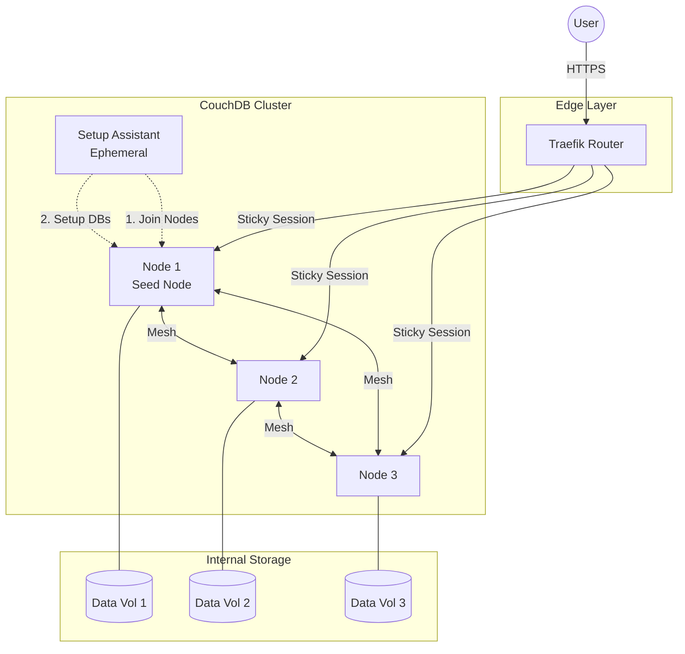

# CouchDB Cluster

## Overview

A high-availability **3-node CouchDB Cluster** designed for distributed data storage and fault tolerance. This setup leverages CouchDB's native clustering capabilities, using a dedicated initialization assistant to automate node discovery and cluster creation.



## Services

| Service | Image | Role | Resources |
| :--- | :--- | :--- | :--- |
| `couchdb-1` | `couchdb:3.5.1` | Seed & Management Node | *(Implicit)* |
| `couchdb-2..3` | `couchdb:3.5.1` | Cluster Data Member | *(Implicit)* |
| `couchdb-cluster-init`| `curlimages/curl:8.18.0`| Setup Assistant (One-shot) | 0.1 CPU / 128MB |

## Networking

All nodes communicate internally via Erlang's distributed protocol on the `infra_net` network.

| Service | Host Alias | Database Port | Cluster Ports (Internal) |
| :--- | :--- | :--- | :--- |
| `couchdb-1..3` | `couchdb-X.infra_net` | `5984` (HTTP API) | `4369` (EPMD), `9100-9200` |

## Initialization Process

The cluster is automatically bootstrapped by the `couchdb-cluster-init` container:

1. **Readiness**: Waits for all 3 nodes to be healthy.
2. **Enable Cluster**: Configures nodes to participate in a cluster.
3. **Join Nodes**: Joins `couchdb-2` and `couchdb-3` to the seed node (`couchdb-1`).
4. **Finalize**: Completes the setup and creates standard system databases (`_users`, `_replicator`, `_global_changes`).

## Persistence

Each node maintains its own independent data volume to ensure multi-node redundancy:

- **Mount Point**: `/opt/couchdb/data`
- **Volume Type**: Docker Named Volumes (`couchdbX-data`)

## Traefik Integration & Sticky Sessions

CouchDB requires **Sticky Sessions** (Session Affinity) to maintain consistency for certain request sequences when accessed via a load balancer.

- **URL**: `https://couchdb.${DEFAULT_URL}`
- **Router**: `couchdb` (TLS Enabled)
- **Service**: `couchdb-cluster` (Load Balancer)
- **Affinity**: Traefik uses a cookie (`couchdb_sticky`) to ensure a client stays with the same node during their session.

## Usage

### 1. Web UI (Fauxton)

Access the management dashboard at `https://couchdb.${DEFAULT_URL}/_utils`.

### 2. API Access

```bash
# Check cluster status
curl -u admin:password https://couchdb.${DEFAULT_URL}/_membership

# Create a database
curl -X PUT -u admin:password https://couchdb.${DEFAULT_URL}/my_new_db
```

## Troubleshooting

### "Cluster not fully joined"

Check the logs of the initialization container:

```bash
docker logs couchdb-cluster-init
```

### "Consistency Issues"

Ensure your client supports HTTP cookies to take advantage of Traefik's sticky sessions, or target a specific node alias if performing cluster maintenance.
