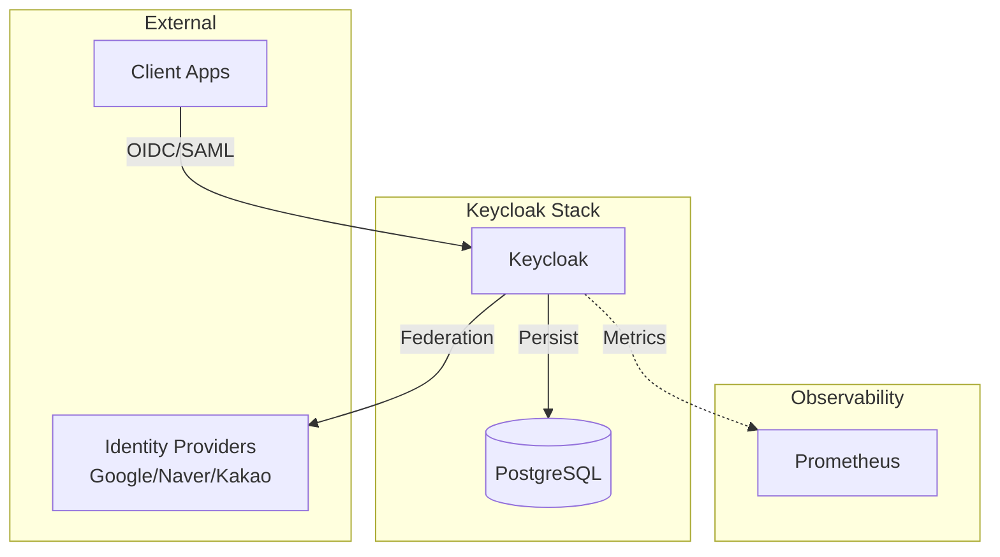

# Keycloak IAM

## Overview

An open-source **Identity and Access Management (IAM)** solution providing SSO (Single Sign-On), Identity Brokering, and User Federation. This deployment is configured for **Production-Grade** capabilities (PostgreSQL backend) running in development mode for easier configuration updates.



## Services

| Service | Image | Role | Resources | Port |
| :--- | :--- | :--- | :--- | :--- |
| `keycloak` | `quay.io/keycloak/keycloak:26.5.0` | IAM Provider | 1 CPU / 1GB | 8080 (Int) |

## Networking

Services run on `infra_net` with static IPs.

| Service | Static IP | Endpoint | Host Port |
| :--- | :--- | :--- | :--- |
| `keycloak` | `172.19.0.29` | `keycloak.${DEFAULT_URL}` | `${KEYCLOAK_MANAGEMENT_PORT}` |

## Persistence

Data is stored in the external **PostgreSQL** database (typically `postgres-cluster` or `management-db`). Keycloak itself is stateless except for the database connection.

- **Database**: `jdbc:postgresql://${POSTGRES_HOSTNAME}:${POSTGRES_PORT}/${KEYCLOAK_DBNAME}`

## Configuration

### Core Environment Variables

| Variable | Description | Value |
| :--- | :--- | :--- |
| `KC_DB` | Database Vendor | `postgres` |
| `KEYCLOAK_ADMIN` | Admin Username | `${KEYCLOAK_ADMIN_USER}` |
| `KC_HOSTNAME` | Public URL | `https://keycloak.${DEFAULT_URL}` |
| `KC_PROXY_HEADERS` | Proxy Mode | `xforwarded` (Trusts Traefik) |

### Performance & Usage

- **Metrics**: `KC_METRICS_ENABLED=true` (Scraped by Prometheus)
- **Health**: `KC_HEALTH_ENABLED=true`
- **Connection Pool**: Min 1, Max 10 connections to DB.
- **JVM Options**: Configured for aggressive idle connection removal (`-Dquarkus.datasource.jdbc.idle-removal-interval=5M`).

## Custom Build

This directory contains a `Dockerfile` for building a custom Keycloak image. This is required for:

1. **Pre-installing Providers**: Adding custom SPI JARs to `/opt/keycloak/providers/`.
2. **Custom Themes**: Adding branding to `/opt/keycloak/themes/`.
3. **Database Drivers**: If switching from Postgres (though not recommended here).

**To use custom build:**

1. Uncomment `build: .` in `docker-compose.yml`.
2. Comment out `image: ...`.
3. Run `docker compose build keycloak`.

## Traefik Integration

Services are exposed via Traefik with TLS enabled.

- **Rule**: `Host(keycloak.${DEFAULT_URL})`
- **Entrypoint**: `websecure`
- **TLS**: Enabled

## Advanced Configuration Guides

### 1. Group Membership Mapping

To map Keycloak groups to OIDC token claims (useful for RBAC):

1. **Client Scopes** > Create `groups` scope.
2. **Mappers** > Add `Group Membership` mapper.
   - Token Claim Name: `groups`
3. **Clients** > Your App > Client Scopes > Add `groups` as Default.

### 2. Social Login (Identity Providers)

#### Google

1. Create OAuth2 Client in GCP Console.
2. In Keycloak: **Identity Providers** > **Google**.
3. Paste Client ID/Secret.

#### Naver (OIDC)

- **Auth URL**: `https://nid.naver.com/oauth2.0/authorize`
- **Token URL**: `https://nid.naver.com/oauth2.0/token`
- **User Info**: `https://openapi.naver.com/v1/nid/me`

#### Kakao (OIDC)

- **Auth URL**: `https://kauth.kakao.com/oauth/authorize`
- **Token URL**: `https://kauth.kakao.com/oauth/token`
- **User Info**: `https://kapi.kakao.com/v2/user/me`

### Redirect URI

```text
http://keycloak.${DEFAULT_URL}/auth/realms/hy-home.realm/protocol/openid-connect/auth
https://vault.${DEFAULT_URL}/ui/vault/auth/oidc/oidc/callback
https://vault.${DEFAULT_URL}/oidc/callback
https://grafana.${DEFAULT_URL}/login/generic_oauth
https://auth.${DEFAULT_URL}/oauth2/callback
https://grafana.${DEFAULT_URL}/login
```

### Valid post logout redirect URIs

```text
https://keycloak.${DEFAULT_URL}/realms/hy-home.realm/protocol/openid-connect/logout?post_logout_redirect_uri=https://grafana.${DEFAULT_URL}/login
https://grafana.${DEFAULT_URL}/login
```