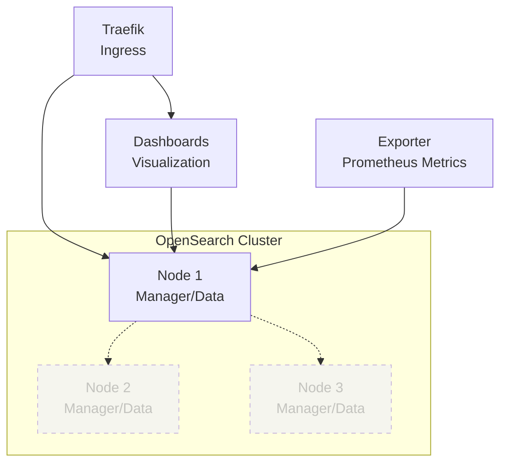

# OpenSearch Cluster

## Overview

A scalable search and analytics suite derived from Elasticsearch. This deployment is configured as a **Single Node** cluster by default for development/testing, but includes configuration for a robust **3-Node High Availability Cluster**.



## Services

| Service | Image | Role | Status | Resources |
| :--- | :--- | :--- | :--- | :--- |
| `opensearch-node1` | `opensearchproject/opensearch:3.4.0` | Cluster Manager, Data, Ingest | Active | 1 CPU / 1GB |
| `opensearch-node2` | `opensearchproject/opensearch:3.4.0` | Cluster Manager, Data, Ingest | Optional | 1 CPU / 1GB |
| `opensearch-node3` | `opensearchproject/opensearch:3.4.0` | Cluster Manager, Data, Ingest | Optional | 1 CPU / 1GB |
| `opensearch-dashboards` | `opensearchproject/opensearch-dashboards:3.4.0` | Visualization UI (Kibana fork) | Active | 0.5 CPU / 512MB |
| `opensearch-exporter` | `prometheuscommunity/elasticsearch-exporter:v1.10.0` | Prometheus Metrics | Active | 0.1 CPU / 128MB |

## Networking

All services run on `infra_net` with static IPs in the `172.19.0.4X` range.

| Service | Static IP | Port | Host Port | Traefik Domain |
| :--- | :--- | :--- | :--- | :--- |
| `opensearch-node1` | `172.19.0.44` | `9200` | - | `opensearch.${DEFAULT_URL}` |
| `opensearch-node2` | `172.19.0.45` | `9200` | - | - |
| `opensearch-node3` | `172.19.0.46` | `9200` | - | - |
| `opensearch-dashboards` | `172.19.0.47` | `5601` | `${KIBANA_HOST_PORT}` | `opensearch-dashboard.${DEFAULT_URL}` |
| `opensearch-exporter` | `172.19.0.48` | `9114` | `${ES_EXPORTER_HOST_PORT}` | - |

## Persistence

| Volume | Mount Point | Description |
| :--- | :--- | :--- |
| `opensearch-data1` | `/usr/share/opensearch/data` | Node 1 Data |
| `opensearch-data2` | `/usr/share/opensearch/data` | Node 2 Data (Optional) |
| `opensearch-data3` | `/usr/share/opensearch/data` | Node 3 Data (Optional) |
| `./certs` | `/usr/share/opensearch/config/certs` | SSL/TLS Certificates (Read-only) |

## Configuration

### Environment Variables

| Variable | Description | Default |
| :--- | :--- | :--- |
| `ELASTIC_PASSWORD` | Admin Password | Provided via `.env` |
| `OPENSEARCH_JAVA_OPTS` | JVM Heap Size | `-Xms1g -Xmx1g` |
| `OPENSEARCH_CLUSTER_NAME` | Cluster Name | `docker-cluster` |
| `discovery.type` | Discovery Mode | `single-node` (for 1 node) |

### Performance Tuning

- **Memory Locking**: `bootstrap.memory_lock=true` is enabled to prevent swapping.
- **Ulimits**: `nofile` (65536) and `memlock` (unlimited) are configured.
- **SHM Size**: `1g` shared memory is allocated for Performance Analyzer.

## Custom Build (Plugins)

A `Dockerfile` is provided to build a custom image with plugins pre-installed.

**Included Plugins:**

- `analysis-nori`: Korean morphological analyzer
- `ingest-attachment`: Tika-based document processor
- `mapper-annotated-text`: Indexing annotated text
- `mapper-murmur3`: Murmur3 field mapper
- `mapper-size`: _size field mapper

**To use custom build:**
Uncomment the `build` section in `docker-compose.yml` and comment out `image`.

## Usage

### 1. Accessing Dashboards

- **URL**: `https://opensearch-dashboard.${DEFAULT_URL}`
- **Credentials**: user: `${ELASTIC_USERNAME}` / pass: `${ELASTIC_PASSWORD}`

### 2. Accessing API

- **URL**: `https://opensearch.${DEFAULT_URL}`
- **Note**: Self-signed certificate warning is expected.

```bash
curl -k -u admin:${OPENSEARCH_ADMIN_PASSWORD} https://opensearch.${DEFAULT_URL}/_cluster/health?pretty
```

### 3. Scaling to 3 Nodes

1. Edit `docker-compose.yml`:
   - Uncomment `opensearch-node2` and `opensearch-node3`.
   - Comment out `discovery.type=single-node`.
   - Uncomment `discovery.seed_hosts` and `cluster.initial_cluster_manager_nodes`.
2. Deploy:

   ```bash
   docker compose up -d
   ```

## Exporter Metrics (Prometheus)

`opensearch-exporter` collects cluster metrics and requires read-only monitor permissions.
Because the built-in `readall` role is reserved/static, use a dedicated role and mapping:

- Role definition: `infra/opensearch/opensearch/config/opensearch-security/roles.yml` (`exporter_role`)
- Role mapping: `infra/opensearch/opensearch/config/opensearch-security/roles_mapping.yml` (map user `exporter`)

### Apply security changes (REST API)

`securityadmin.sh` may fail if the client certificate does not allow TLS client auth. Use the REST API instead:

```bash
docker exec opensearch bash -lc '
cat <<'"'"'JSON'"'"' >/tmp/exporter_role.json
{
  "cluster_permissions": ["cluster:monitor/*"],
  "index_permissions": [
    {
      "index_patterns": ["*"],
      "allowed_actions": [
        "indices:monitor/*",
        "indices:admin/get",
        "indices:admin/aliases/get",
        "indices:data/read/*"
      ],
      "fls": [],
      "masked_fields": []
    }
  ]
}
JSON

curl -ks -u admin:${OPENSEARCH_ADMIN_PASSWORD} \
  -H "Content-Type: application/json" \
  -XPUT https://localhost:9200/_plugins/_security/api/roles/exporter_role \
  -d @/tmp/exporter_role.json
'

docker exec opensearch bash -lc '
cat <<'"'"'JSON'"'"' >/tmp/exporter_role_mapping.json
{
  "users": ["exporter"]
}
JSON

curl -ks -u admin:${OPENSEARCH_ADMIN_PASSWORD} \
  -H "Content-Type: application/json" \
  -XPUT https://localhost:9200/_plugins/_security/api/rolesmapping/exporter_role \
  -d @/tmp/exporter_role_mapping.json
'
```

### Verify

```bash
docker exec opensearch bash -lc "curl -ks -u exporter:${OPENSEARCH_EXPORTER_PASSWORD} https://localhost:9200/_cluster/health"
curl http://localhost:${ES_EXPORTER_HOST_PORT}/metrics
```

## Troubleshooting

### Node Not Joining

Check logs for discovery errors. Ensure `discovery.seed_hosts` matches container names.

### "max virtual memory areas vm.max_map_count is too low"

Linux hosts require increasing the mmap count:

```bash
sysctl -w vm.max_map_count=262144
```

### Certificate Issues

If Traefik returns "Bad Gateway", it might be due to SSL verification failure.
Check `traefik.http.services.opensearch.loadbalancer.server.scheme=https`.
