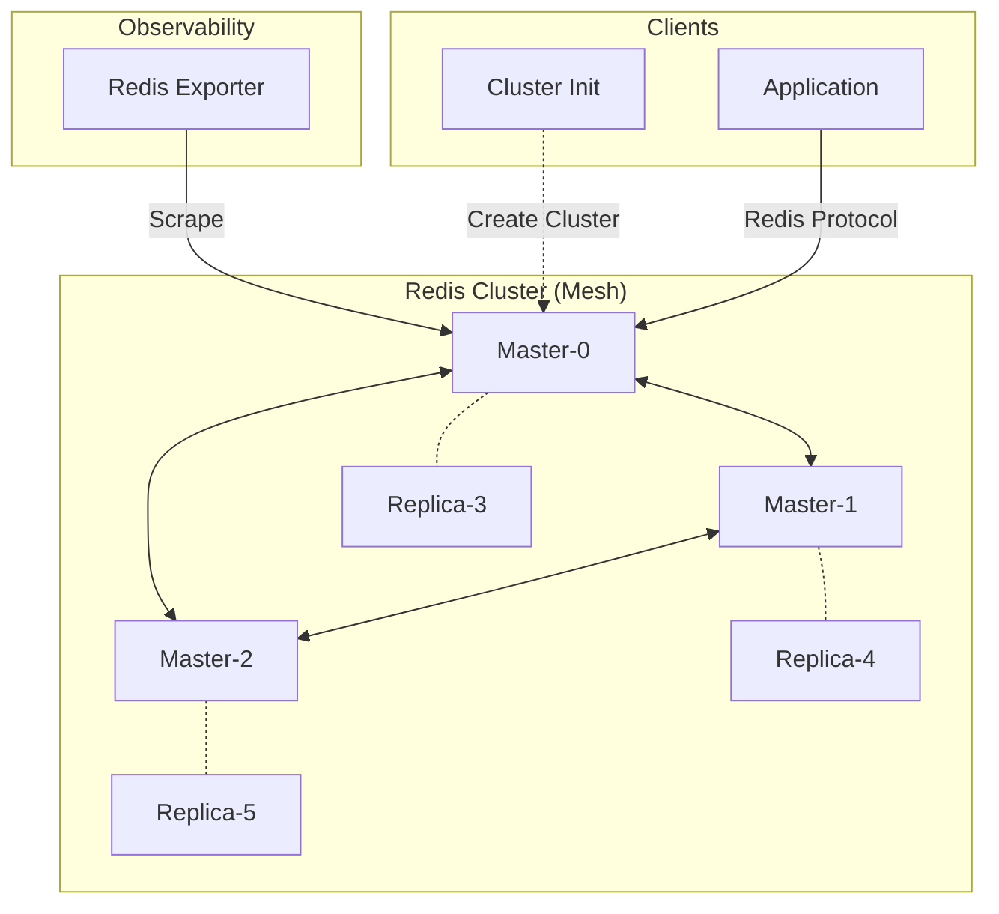

# Redis Cluster

## Overview

A distributed **Redis Cluster** configured for horizontal scalability and high availability. It consists of **6 nodes** (3 Masters, 3 Replicas) with automatic data sharding and failover capabilities.



## Services

| Service | Image | Role | Resources |
| :--- | :--- | :--- | :--- |
| `redis-node-{0..5}` | `redis:8.4.0-bookworm` | Data Node (Sharded) | 0.5 CPU / 512MB |
| `redis-cluster-init` | `redis:8.4` | Cluster Bootstrap Script | 0.1 CPU / 128MB |
| `redis-exporter` | `oliver006/redis_exporter` | Prometheus Metrics | 0.1 CPU / 128MB |

## Networking

Services run on `infra_net` with static IPs (`172.19.0.6X`).

| Service | Static IP | Internal Port | Host Port |
| :--- | :--- | :--- | :--- |
| `redis-node-0` | `172.19.0.60` | `${REDIS0_PORT}` | `${REDIS0_PORT}` |
| `redis-node-1` | `172.19.0.61` | `${REDIS1_PORT}` | `${REDIS1_PORT}` |
| `redis-node-2` | `172.19.0.62` | `${REDIS2_PORT}` | `${REDIS2_PORT}` |
| `redis-node-3` | `172.19.0.63` | `${REDIS3_PORT}` | `${REDIS3_PORT}` |
| `redis-node-4` | `172.19.0.64` | `${REDIS4_PORT}` | `${REDIS4_PORT}` |
| `redis-node-5` | `172.19.0.65` | `${REDIS5_PORT}` | `${REDIS5_PORT}` |
| `redis-cluster-init` | `172.19.0.66` | - | - |
| `redis-exporter` | `172.19.0.67` | `${REDIS_EXPORTER_PORT}` | `${REDIS_EXPORTER_HOST_PORT}` |

## Persistence

| Volume | Description |
| :--- | :--- |
| `redis-data-{0..5}` | Persists AOF/RDB data mapped to `/data` |
| `./config/redis.conf` | Shared configuration file (Bind Mount) |
| `./scripts/` | Startup and Init scripts (Bind Mount) |

## Configuration

- **Sharding**: Auto-negotiated via `redis-cluster-init.sh` using `redis-cli --cluster create`.
- **Password**: Securely managed via Docker Secrets (`redis_password`).
- **Ports**: Configurable via `.env` (Default range 6379-6384).

## Usage

### Connecting (Internal)

Applications **MUST** use a Redis Cluster-aware library (e.g., `redis-py` with `RedisCluster`, `ioredis` in Node.js).
Seed nodes: `redis-node-0:6379`, `redis-node-1:6380`, etc.

### Connecting (Debugging)

To manually interact with the cluster from the specific node:

```bash
# Connect to node-0
docker exec -it redis-node-0 redis-cli -c -a $(cat /run/secrets/redis_password) -p 6379
```

*Note: The `-c` flag enables cluster mode redirection.*

### Usage from Host

Host ports are mapped for convenience, but **Cluster Redirection** (MOVED errors) will return internal container IPs (`172.19.0.XX`), which are unreachable from the Windows host.
For robust local development, use `redis-node-0` strictly as a standalone (non-cluster) cache or use a VPN/Tunnel if cluster topology awareness is required.

## Troubleshooting

### "Cluster Down"

- Check if `redis-cluster-init` container ran successfully.
- Verify at least 3 master nodes are healthy: `cluster nodes` command inside `redis-cli`.

### "MOVED 12345 172.19.0.61:6380"

This is normal Redis Cluster behavior. The client must be able to reach the IP returned.

- **Inside Docker**: Works fine.
- **From Host**: Fails because Host cannot reach `172.19.x.x` directly without routing.
