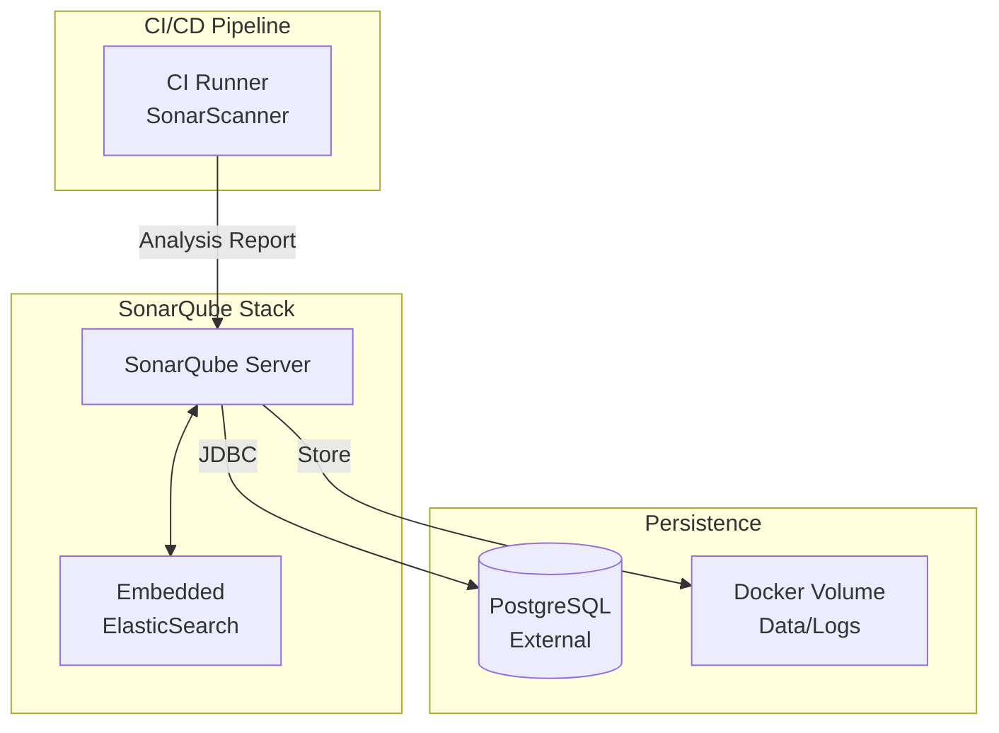

# SonarQube

## Overview

**SonarQube** is a continuous code quality inspection platform that performs automatic reviews with static analysis of code to detect bugs, code smells, and security vulnerabilities. It supports 25+ programming languages.



## Services

| Service | Image | Role | Resources |
| :--- | :--- | :--- | :--- |
| `sonarqube` | `sonarqube:26.1.0.118079-community` | Code Quality Server | 0.5 CPU / 512MB |

## Networking

Service runs on `infra_net` using **Dynamic** IP assignment (DHCP).

| Service | IP Address | Internal Port | Traefik Domain |
| :--- | :--- | :--- | :--- |
| `sonarqube` | *(Dynamic)* | `${SONARQUBE_PORT}` (9000) | `sonarqube.${DEFAULT_URL}` |

## Persistence

| Volume | Mount Point | Description |
| :--- | :--- | :--- |
| `sonarqube-data-volume` | `/opt/sonarqube/data` | Plugins, embedded ES data |
| `sonarqube-logs-volume` | `/opt/sonarqube/logs` | Access and error logs |

## Configuration

### Database Connection

SonarQube requires a dedicated PostgreSQL database. In this infrastructure, it connects to the shared Management DB (`infra/mng-db`) or a dedicated instance.

| Variable | Description | Value |
| :--- | :--- | :--- |
| `SONAR_JDBC_URL` | Connection String | `jdbc:postgresql://${POSTGRES_HOSTNAME}:${POSTGRES_PORT}/${SONARQUBE_DBNAME}` |
| `SONAR_JDBC_USERNAME` | DB User | `${SONARQUBE_DB_USER}` |
| `SONAR_JDBC_PASSWORD` | DB Password | `${SONARQUBE_DB_PASSWORD}` |

### Kernel Requirements (Important)

SonarQube includes an embedded ElasticSearch instance which requires specific host kernel settings. If the container exits immediately with code 78, ensure:

```bash
# On Host Machine (Linux/WSL2)
sysctl -w vm.max_map_count=262144
```

To make it permanent in `/etc/sysctl.conf`:

```properties
vm.max_map_count=262144
```

## Usage

### 1. Web Dashboard

- **URL**: `https://sonarqube.${DEFAULT_URL}`
- **Default Creds**: `admin` / `admin` (Change on first login)

### 2. Running Analysis (Local)

You can run a scan using Docker without installing the scanner locally:

```bash
docker run \
    --rm \
    -e SONAR_HOST_URL="https://sonarqube.${DEFAULT_URL}" \
    -e SONAR_TOKEN="<your-generated-token>" \
    -v "${PWD}:/usr/src" \
    sonarsource/sonar-scanner-cli
```

## Troubleshooting

### "ElasticSearch did not exit normally"

Check `vm.max_map_count` as described in [Configuration](#kernel-requirements-important).

### "Database connection failed"

Ensure the PostgreSQL container is consistent and the `sonarqube` database exists and is accessible by the configured user.
